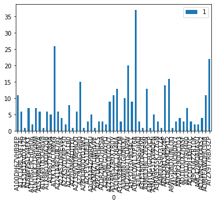
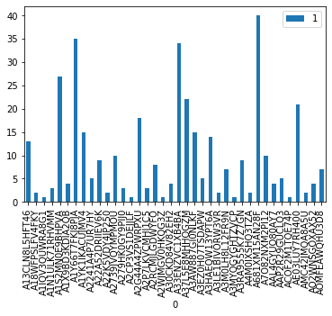
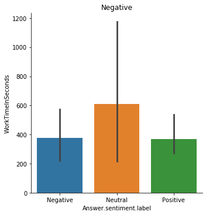
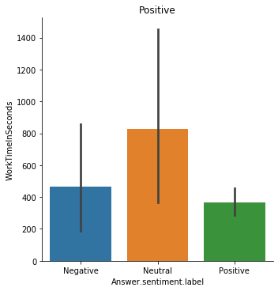
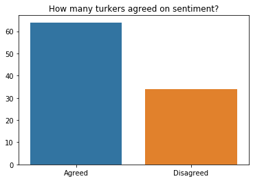
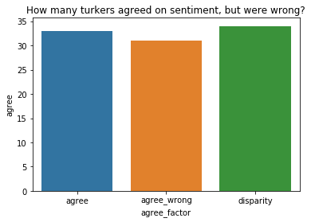
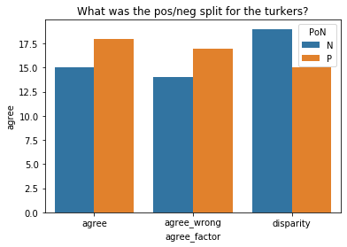

# HW5 -- Artificial Artificial Intelligence


```python
import pandas as pd
import numpy as np

neg = pd.read_csv('AMT_neg.csv')
pos = pd.read_csv('AMT_pos.csv')
```

## Initial EDA


```python
neg[:3]
```


<div>
<style scoped>
    .dataframe tbody tr th:only-of-type {
        vertical-align: middle;
    }

    .dataframe tbody tr th {
        vertical-align: top;
    }

    .dataframe thead th {
        text-align: right;
    }
</style>
<table border="1" class="dataframe">
  <thead>
    <tr style="text-align: right;">
      <th></th>
      <th>HITId</th>
      <th>HITTypeId</th>
      <th>Title</th>
      <th>Description</th>
      <th>Keywords</th>
      <th>Reward</th>
      <th>CreationTime</th>
      <th>MaxAssignments</th>
      <th>RequesterAnnotation</th>
      <th>AssignmentDurationInSeconds</th>
      <th>...</th>
      <th>RejectionTime</th>
      <th>RequesterFeedback</th>
      <th>WorkTimeInSeconds</th>
      <th>LifetimeApprovalRate</th>
      <th>Last30DaysApprovalRate</th>
      <th>Last7DaysApprovalRate</th>
      <th>Input.text</th>
      <th>Answer.sentiment.label</th>
      <th>Approve</th>
      <th>Reject</th>
    </tr>
  </thead>
  <tbody>
    <tr>
      <td>0</td>
      <td>3IQ9O0AYW6ZI3GD740H32KGG2SWITJ</td>
      <td>3N0K7CX2I27L2NR2L8D93MF8LIRA5J</td>
      <td>Sentiment analysis</td>
      <td>Sentiment analysis</td>
      <td>sentiment, text</td>
      <td>$0.02</td>
      <td>Fri Nov 01 12:08:17 PDT 2019</td>
      <td>3</td>
      <td>BatchId:3821423;OriginalHitTemplateId:928390909;</td>
      <td>10800</td>
      <td>...</td>
      <td>NaN</td>
      <td>NaN</td>
      <td>44</td>
      <td>0% (0/0)</td>
      <td>0% (0/0)</td>
      <td>0% (0/0)</td>
      <td>Missed Opportunity\nI had been very excited to...</td>
      <td>Neutral</td>
      <td>NaN</td>
      <td>NaN</td>
    </tr>
    <tr>
      <td>1</td>
      <td>3IQ9O0AYW6ZI3GD740H32KGG2SWITJ</td>
      <td>3N0K7CX2I27L2NR2L8D93MF8LIRA5J</td>
      <td>Sentiment analysis</td>
      <td>Sentiment analysis</td>
      <td>sentiment, text</td>
      <td>$0.02</td>
      <td>Fri Nov 01 12:08:17 PDT 2019</td>
      <td>3</td>
      <td>BatchId:3821423;OriginalHitTemplateId:928390909;</td>
      <td>10800</td>
      <td>...</td>
      <td>NaN</td>
      <td>NaN</td>
      <td>7</td>
      <td>0% (0/0)</td>
      <td>0% (0/0)</td>
      <td>0% (0/0)</td>
      <td>Missed Opportunity\nI had been very excited to...</td>
      <td>Negative</td>
      <td>NaN</td>
      <td>NaN</td>
    </tr>
    <tr>
      <td>2</td>
      <td>3IQ9O0AYW6ZI3GD740H32KGG2SWITJ</td>
      <td>3N0K7CX2I27L2NR2L8D93MF8LIRA5J</td>
      <td>Sentiment analysis</td>
      <td>Sentiment analysis</td>
      <td>sentiment, text</td>
      <td>$0.02</td>
      <td>Fri Nov 01 12:08:17 PDT 2019</td>
      <td>3</td>
      <td>BatchId:3821423;OriginalHitTemplateId:928390909;</td>
      <td>10800</td>
      <td>...</td>
      <td>NaN</td>
      <td>NaN</td>
      <td>449</td>
      <td>0% (0/0)</td>
      <td>0% (0/0)</td>
      <td>0% (0/0)</td>
      <td>Missed Opportunity\nI had been very excited to...</td>
      <td>Positive</td>
      <td>NaN</td>
      <td>NaN</td>
    </tr>
  </tbody>
</table>
<p>3 rows × 31 columns</p>
</div>


```python
pos[:3]
```


<div>
<style scoped>
    .dataframe tbody tr th:only-of-type {
        vertical-align: middle;
    }

    .dataframe tbody tr th {
        vertical-align: top;
    }

    .dataframe thead th {
        text-align: right;
    }
</style>
<table border="1" class="dataframe">
  <thead>
    <tr style="text-align: right;">
      <th></th>
      <th>HITId</th>
      <th>HITTypeId</th>
      <th>Title</th>
      <th>Description</th>
      <th>Keywords</th>
      <th>Reward</th>
      <th>CreationTime</th>
      <th>MaxAssignments</th>
      <th>RequesterAnnotation</th>
      <th>AssignmentDurationInSeconds</th>
      <th>...</th>
      <th>RejectionTime</th>
      <th>RequesterFeedback</th>
      <th>WorkTimeInSeconds</th>
      <th>LifetimeApprovalRate</th>
      <th>Last30DaysApprovalRate</th>
      <th>Last7DaysApprovalRate</th>
      <th>Input.text</th>
      <th>Answer.sentiment.label</th>
      <th>Approve</th>
      <th>Reject</th>
    </tr>
  </thead>
  <tbody>
    <tr>
      <td>0</td>
      <td>3VMV5CHJZ8F47P7CECH0H830NF4GTP</td>
      <td>3N0K7CX2I27L2NR2L8D93MF8LIRA5J</td>
      <td>Sentiment analysis</td>
      <td>Sentiment analysis</td>
      <td>sentiment, text</td>
      <td>$0.02</td>
      <td>Fri Nov 01 12:11:19 PDT 2019</td>
      <td>3</td>
      <td>BatchId:3821427;OriginalHitTemplateId:928390909;</td>
      <td>10800</td>
      <td>...</td>
      <td>NaN</td>
      <td>NaN</td>
      <td>355</td>
      <td>0% (0/0)</td>
      <td>0% (0/0)</td>
      <td>0% (0/0)</td>
      <td>funny like a clown\nGreetings again from the d...</td>
      <td>Positive</td>
      <td>NaN</td>
      <td>NaN</td>
    </tr>
    <tr>
      <td>1</td>
      <td>3VMV5CHJZ8F47P7CECH0H830NF4GTP</td>
      <td>3N0K7CX2I27L2NR2L8D93MF8LIRA5J</td>
      <td>Sentiment analysis</td>
      <td>Sentiment analysis</td>
      <td>sentiment, text</td>
      <td>$0.02</td>
      <td>Fri Nov 01 12:11:19 PDT 2019</td>
      <td>3</td>
      <td>BatchId:3821427;OriginalHitTemplateId:928390909;</td>
      <td>10800</td>
      <td>...</td>
      <td>NaN</td>
      <td>NaN</td>
      <td>487</td>
      <td>0% (0/0)</td>
      <td>0% (0/0)</td>
      <td>0% (0/0)</td>
      <td>funny like a clown\nGreetings again from the d...</td>
      <td>Neutral</td>
      <td>NaN</td>
      <td>NaN</td>
    </tr>
    <tr>
      <td>2</td>
      <td>3VMV5CHJZ8F47P7CECH0H830NF4GTP</td>
      <td>3N0K7CX2I27L2NR2L8D93MF8LIRA5J</td>
      <td>Sentiment analysis</td>
      <td>Sentiment analysis</td>
      <td>sentiment, text</td>
      <td>$0.02</td>
      <td>Fri Nov 01 12:11:19 PDT 2019</td>
      <td>3</td>
      <td>BatchId:3821427;OriginalHitTemplateId:928390909;</td>
      <td>10800</td>
      <td>...</td>
      <td>NaN</td>
      <td>NaN</td>
      <td>1052</td>
      <td>0% (0/0)</td>
      <td>0% (0/0)</td>
      <td>0% (0/0)</td>
      <td>funny like a clown\nGreetings again from the d...</td>
      <td>Positive</td>
      <td>NaN</td>
      <td>NaN</td>
    </tr>
  </tbody>
</table>
<p>3 rows × 31 columns</p>
</div>


```python
neg.columns.tolist()
```


    ['HITId',
     'HITTypeId',
     'Title',
     'Description',
     'Keywords',
     'Reward',
     'CreationTime',
     'MaxAssignments',
     'RequesterAnnotation',
     'AssignmentDurationInSeconds',
     'AutoApprovalDelayInSeconds',
     'Expiration',
     'NumberOfSimilarHITs',
     'LifetimeInSeconds',
     'AssignmentId',
     'WorkerId',
     'AssignmentStatus',
     'AcceptTime',
     'SubmitTime',
     'AutoApprovalTime',
     'ApprovalTime',
     'RejectionTime',
     'RequesterFeedback',
     'WorkTimeInSeconds',
     'LifetimeApprovalRate',
     'Last30DaysApprovalRate',
     'Last7DaysApprovalRate',
     'Input.text',
     'Answer.sentiment.label',
     'Approve',
     'Reject']


### How many unique turkers worked on each dataframe?


```python
def get_unique(df, column):
    unique = np.unique(df[column], return_counts=True)
    df = pd.DataFrame(zip(unique[0], unique[1]))
    return len(unique[0]), unique, df

num_neg, unique_neg, u_neg_df = get_unique(neg, 'WorkerId')    
num_pos, unique_pos, u_pos_df = get_unique(pos, 'WorkerId')

print(num_neg, 'Turkers worked on NEG batch')
print(num_pos, 'Turkers worked on POS batch')
```

    53 Turkers worked on NEG batch
    38 Turkers worked on POS batch


### How many HITS did each unique turker do?


```python
u_neg_df.plot(kind='bar',x=0,y=1)
```


    <matplotlib.axes._subplots.AxesSubplot at 0x11aa920b8>





```python
u_pos_df.plot(kind='bar',x=0,y=1)
```


    <matplotlib.axes._subplots.AxesSubplot at 0x11c0be898>





### What's the `max` and `min` HIT for unique turkers


```python
print('For {}, the min was: {} and the max was: {}'.format('neg', unique_neg[1].min(), unique_neg[1].max())) 
print('For {}, the min was: {} and the max was: {}'.format('pos', unique_pos[1].min(), unique_pos[1].max())) 
```

    For neg, the min was: 1 and the max was: 37
    For pos, the min was: 1 and the max was: 40


### Did a specitic Sentiment take longer for turkers to assess? 


```python
import seaborn as sns
import matplotlib.pyplot as plt
sns.catplot(x="Answer.sentiment.label", 
            y="WorkTimeInSeconds", 
            kind="bar", 
            order=['Negative', 'Neutral', 'Positive'], 
            data=neg);
plt.title('Negative')
```


    Text(0.5, 1, 'Negative')





```python
sns.catplot(x="Answer.sentiment.label", 
            y="WorkTimeInSeconds", 
            kind="bar", 
            order=['Negative', 'Neutral', 'Positive'], 
            data=pos)
plt.title('Positive')
```


    Text(0.5, 1, 'Positive')





### How many turkers had less than 10 second response time?


```python
response_time = neg[neg['WorkTimeInSeconds'] < 10]
response_time_check = neg[neg['WorkTimeInSeconds'] > 10]
```


```python
len(response_time)
```


    48


```python
len(response_time_check)
```


    312


### Checking for potential bots

#### Did anyone have a consistent average low response time?


```python
count = pos.groupby(['WorkerId'])['HITId'].count()
work_time = pos.groupby(['WorkerId'])['WorkTimeInSeconds'].mean()
new_df = pd.DataFrame([work_time, count]).T
new_df[:5]
```


<div>
<style scoped>
    .dataframe tbody tr th:only-of-type {
        vertical-align: middle;
    }

    .dataframe tbody tr th {
        vertical-align: top;
    }

    .dataframe thead th {
        text-align: right;
    }
</style>
<table border="1" class="dataframe">
  <thead>
    <tr style="text-align: right;">
      <th></th>
      <th>WorkTimeInSeconds</th>
      <th>HITId</th>
    </tr>
    <tr>
      <th>WorkerId</th>
      <th></th>
      <th></th>
    </tr>
  </thead>
  <tbody>
    <tr>
      <td>A13CLN8L5HFT46</td>
      <td>7.230769</td>
      <td>13.0</td>
    </tr>
    <tr>
      <td>A18WFPSLFV4FKY</td>
      <td>47.000000</td>
      <td>2.0</td>
    </tr>
    <tr>
      <td>A1IQV3QUWRA8G1</td>
      <td>22.000000</td>
      <td>1.0</td>
    </tr>
    <tr>
      <td>A1N1ULK71RHVMM</td>
      <td>10.000000</td>
      <td>3.0</td>
    </tr>
    <tr>
      <td>A1S2MN0E9BHPVA</td>
      <td>173.444444</td>
      <td>27.0</td>
    </tr>
  </tbody>
</table>
</div>


#### Did anyone have a consistent average high response time?


```python
new_df['WorkTimeInMin'] = new_df['WorkTimeInSeconds']/60
new_df[:5]
```


<div>
<style scoped>
    .dataframe tbody tr th:only-of-type {
        vertical-align: middle;
    }

    .dataframe tbody tr th {
        vertical-align: top;
    }

    .dataframe thead th {
        text-align: right;
    }
</style>
<table border="1" class="dataframe">
  <thead>
    <tr style="text-align: right;">
      <th></th>
      <th>WorkTimeInSeconds</th>
      <th>HITId</th>
      <th>WorkTimeInMin</th>
    </tr>
    <tr>
      <th>WorkerId</th>
      <th></th>
      <th></th>
      <th></th>
    </tr>
  </thead>
  <tbody>
    <tr>
      <td>A13CLN8L5HFT46</td>
      <td>7.230769</td>
      <td>13.0</td>
      <td>0.120513</td>
    </tr>
    <tr>
      <td>A18WFPSLFV4FKY</td>
      <td>47.000000</td>
      <td>2.0</td>
      <td>0.783333</td>
    </tr>
    <tr>
      <td>A1IQV3QUWRA8G1</td>
      <td>22.000000</td>
      <td>1.0</td>
      <td>0.366667</td>
    </tr>
    <tr>
      <td>A1N1ULK71RHVMM</td>
      <td>10.000000</td>
      <td>3.0</td>
      <td>0.166667</td>
    </tr>
    <tr>
      <td>A1S2MN0E9BHPVA</td>
      <td>173.444444</td>
      <td>27.0</td>
      <td>2.890741</td>
    </tr>
  </tbody>
</table>
</div>


```python
count = pos.groupby(['WorkerId', 'Answer.sentiment.label'])['Answer.sentiment.label'].count()
# count = pos.groupby(['WorkerId'])['Answer.sentiment.label'].count()
count
```


    WorkerId        Answer.sentiment.label
    A13CLN8L5HFT46  Neutral                    2
                    Positive                  11
    A18WFPSLFV4FKY  Positive                   2
    A1IQV3QUWRA8G1  Positive                   1
    A1N1ULK71RHVMM  Negative                   1
                                              ..
    AMC42JMQA8A5U   Positive                   1
    AO2WNSGOXAX52   Neutral                    3
                    Positive                   1
    AOMFEAWQHU3D8   Neutral                    1
                    Positive                   6
    Name: Answer.sentiment.label, Length: 74, dtype: int64


#### Did anyone answer ONLY pos/neg/neutral?


```python
pnn = pd.DataFrame()
pnn['Neutral'] = pos.groupby('WorkerId')['Answer.sentiment.label'].apply(lambda x: (x=='Neutral').sum())
pnn['Positive'] = pos.groupby('WorkerId')['Answer.sentiment.label'].apply(lambda x: (x=='Positive').sum())
pnn['Negative'] = pos.groupby('WorkerId')['Answer.sentiment.label'].apply(lambda x: (x=='Negative').sum())
pnn['Total'] = pos.groupby('WorkerId')['Answer.sentiment.label'].apply(lambda x: x.count())
pnn[:5]
```


<div>
<style scoped>
    .dataframe tbody tr th:only-of-type {
        vertical-align: middle;
    }

    .dataframe tbody tr th {
        vertical-align: top;
    }

    .dataframe thead th {
        text-align: right;
    }
</style>
<table border="1" class="dataframe">
  <thead>
    <tr style="text-align: right;">
      <th></th>
      <th>Neutral</th>
      <th>Positive</th>
      <th>Negative</th>
      <th>Total</th>
    </tr>
    <tr>
      <th>WorkerId</th>
      <th></th>
      <th></th>
      <th></th>
      <th></th>
    </tr>
  </thead>
  <tbody>
    <tr>
      <td>A13CLN8L5HFT46</td>
      <td>2</td>
      <td>11</td>
      <td>0</td>
      <td>13</td>
    </tr>
    <tr>
      <td>A18WFPSLFV4FKY</td>
      <td>0</td>
      <td>2</td>
      <td>0</td>
      <td>2</td>
    </tr>
    <tr>
      <td>A1IQV3QUWRA8G1</td>
      <td>0</td>
      <td>1</td>
      <td>0</td>
      <td>1</td>
    </tr>
    <tr>
      <td>A1N1ULK71RHVMM</td>
      <td>0</td>
      <td>2</td>
      <td>1</td>
      <td>3</td>
    </tr>
    <tr>
      <td>A1S2MN0E9BHPVA</td>
      <td>2</td>
      <td>21</td>
      <td>4</td>
      <td>27</td>
    </tr>
  </tbody>
</table>
</div>


#### This is getting a little confusing, let's just look at our top performers


```python
top = pnn.sort_values(by=['Total'], ascending=False)
```


```python
top[:10]
```


<div>
<style scoped>
    .dataframe tbody tr th:only-of-type {
        vertical-align: middle;
    }

    .dataframe tbody tr th {
        vertical-align: top;
    }

    .dataframe thead th {
        text-align: right;
    }
</style>
<table border="1" class="dataframe">
  <thead>
    <tr style="text-align: right;">
      <th></th>
      <th>Neutral</th>
      <th>Positive</th>
      <th>Negative</th>
      <th>Total</th>
    </tr>
    <tr>
      <th>WorkerId</th>
      <th></th>
      <th></th>
      <th></th>
      <th></th>
    </tr>
  </thead>
  <tbody>
    <tr>
      <td>A681XM15AN28F</td>
      <td>13</td>
      <td>20</td>
      <td>7</td>
      <td>40</td>
    </tr>
    <tr>
      <td>A1Y66T7FKJ8PJA</td>
      <td>5</td>
      <td>23</td>
      <td>7</td>
      <td>35</td>
    </tr>
    <tr>
      <td>A33ENZVC1XB4BA</td>
      <td>0</td>
      <td>34</td>
      <td>0</td>
      <td>34</td>
    </tr>
    <tr>
      <td>A1S2MN0E9BHPVA</td>
      <td>2</td>
      <td>21</td>
      <td>4</td>
      <td>27</td>
    </tr>
    <tr>
      <td>A37L5E8MHHQGZM</td>
      <td>6</td>
      <td>13</td>
      <td>3</td>
      <td>22</td>
    </tr>
    <tr>
      <td>AE03LUY7RH400</td>
      <td>4</td>
      <td>10</td>
      <td>7</td>
      <td>21</td>
    </tr>
    <tr>
      <td>A2G44A4ZPWRPXU</td>
      <td>4</td>
      <td>12</td>
      <td>2</td>
      <td>18</td>
    </tr>
    <tr>
      <td>A1YK1IKACUJMV4</td>
      <td>0</td>
      <td>15</td>
      <td>0</td>
      <td>15</td>
    </tr>
    <tr>
      <td>A3AW887GI0NLKF</td>
      <td>3</td>
      <td>10</td>
      <td>2</td>
      <td>15</td>
    </tr>
    <tr>
      <td>A3HAEQW13YPT6A</td>
      <td>0</td>
      <td>14</td>
      <td>0</td>
      <td>14</td>
    </tr>
  </tbody>
</table>
</div>


Interesting!! Looking from here, we have three workers who ONLY chose positive. 

Let's look at their response time to see if we can determine if they are a bot!!


```python
top['Avg_WorkTimeInSeconds'] = pos.groupby('WorkerId')['WorkTimeInSeconds'].apply(lambda x: x.mean())
top['Avg_WorkTimeInMin'] = pos.groupby('WorkerId')['WorkTimeInSeconds'].apply(lambda x: x.mean()/60)
top['Min_WorkTimeInMin'] = pos.groupby('WorkerId')['WorkTimeInSeconds'].apply(lambda x: x.min()/60)
top['Max_WorkTimeInMin'] = pos.groupby('WorkerId')['WorkTimeInSeconds'].apply(lambda x: x.max()/60)
```


```python
top[:10]
```


<div>
<style scoped>
    .dataframe tbody tr th:only-of-type {
        vertical-align: middle;
    }

    .dataframe tbody tr th {
        vertical-align: top;
    }

    .dataframe thead th {
        text-align: right;
    }
</style>
<table border="1" class="dataframe">
  <thead>
    <tr style="text-align: right;">
      <th></th>
      <th>Neutral</th>
      <th>Positive</th>
      <th>Negative</th>
      <th>Total</th>
      <th>Avg_WorkTimeInSeconds</th>
      <th>Avg_WorkTimeInMin</th>
      <th>Min_WorkTimeInMin</th>
      <th>Max_WorkTimeInMin</th>
    </tr>
    <tr>
      <th>WorkerId</th>
      <th></th>
      <th></th>
      <th></th>
      <th></th>
      <th></th>
      <th></th>
      <th></th>
      <th></th>
    </tr>
  </thead>
  <tbody>
    <tr>
      <td>A681XM15AN28F</td>
      <td>13</td>
      <td>20</td>
      <td>7</td>
      <td>40</td>
      <td>13.575000</td>
      <td>0.226250</td>
      <td>0.100000</td>
      <td>0.833333</td>
    </tr>
    <tr>
      <td>A1Y66T7FKJ8PJA</td>
      <td>5</td>
      <td>23</td>
      <td>7</td>
      <td>35</td>
      <td>695.857143</td>
      <td>11.597619</td>
      <td>0.216667</td>
      <td>22.000000</td>
    </tr>
    <tr>
      <td>A33ENZVC1XB4BA</td>
      <td>0</td>
      <td>34</td>
      <td>0</td>
      <td>34</td>
      <td>366.647059</td>
      <td>6.110784</td>
      <td>0.616667</td>
      <td>9.916667</td>
    </tr>
    <tr>
      <td>A1S2MN0E9BHPVA</td>
      <td>2</td>
      <td>21</td>
      <td>4</td>
      <td>27</td>
      <td>173.444444</td>
      <td>2.890741</td>
      <td>0.400000</td>
      <td>4.983333</td>
    </tr>
    <tr>
      <td>A37L5E8MHHQGZM</td>
      <td>6</td>
      <td>13</td>
      <td>3</td>
      <td>22</td>
      <td>346.272727</td>
      <td>5.771212</td>
      <td>2.150000</td>
      <td>8.283333</td>
    </tr>
    <tr>
      <td>AE03LUY7RH400</td>
      <td>4</td>
      <td>10</td>
      <td>7</td>
      <td>21</td>
      <td>102.238095</td>
      <td>1.703968</td>
      <td>0.100000</td>
      <td>3.433333</td>
    </tr>
    <tr>
      <td>A2G44A4ZPWRPXU</td>
      <td>4</td>
      <td>12</td>
      <td>2</td>
      <td>18</td>
      <td>221.277778</td>
      <td>3.687963</td>
      <td>0.383333</td>
      <td>7.383333</td>
    </tr>
    <tr>
      <td>A1YK1IKACUJMV4</td>
      <td>0</td>
      <td>15</td>
      <td>0</td>
      <td>15</td>
      <td>593.600000</td>
      <td>9.893333</td>
      <td>1.716667</td>
      <td>11.000000</td>
    </tr>
    <tr>
      <td>A3AW887GI0NLKF</td>
      <td>3</td>
      <td>10</td>
      <td>2</td>
      <td>15</td>
      <td>269.400000</td>
      <td>4.490000</td>
      <td>1.616667</td>
      <td>7.216667</td>
    </tr>
    <tr>
      <td>A3HAEQW13YPT6A</td>
      <td>0</td>
      <td>14</td>
      <td>0</td>
      <td>14</td>
      <td>442.928571</td>
      <td>7.382143</td>
      <td>0.866667</td>
      <td>11.100000</td>
    </tr>
  </tbody>
</table>
</div>


Even more interesting! These two don't appear to be bots, based on our current metric which is time variability.

HOWEVER, worker `A681XM15AN28F` appears to only work for an average of 13 seconds per review which doesn't seem like enough time to read and judge a review...

## PART 2: Second submission to AMT

TOO MANY REVIEWERS!

Here is when we realized that doing a kappa score with over 30 individual reviewers would be tricky, so we rusubmitted to AMT and required the turkers to be 'Master' in the hopes that this additional barrier-to-entry would help reduce the amount of turkers working on the project


```python
v2 = pd.read_csv('HW5_amt_v2.csv')
v2[:5]
len(v2)
```


    293


This time, I didn't separate the df into pos and neg before submitting to AMT, so we have to reimport the labels.


```python
labels = pd.read_csv('all_JK_extremes_labeled.csv')
```


```python
len(labels)
```


    98


Oops! That's right, we replicated each review * 3 so three separate people could look at each review


```python
labels2 = labels.append([labels] * 2, ignore_index=True)
```


```python
len(labels2)
```


    294


```python
labels2.sort_values(by='0')
```


<div>
<style scoped>
    .dataframe tbody tr th:only-of-type {
        vertical-align: middle;
    }

    .dataframe tbody tr th {
        vertical-align: top;
    }

    .dataframe thead th {
        text-align: right;
    }
</style>
<table border="1" class="dataframe">
  <thead>
    <tr style="text-align: right;">
      <th></th>
      <th>0</th>
      <th>PoN</th>
    </tr>
  </thead>
  <tbody>
    <tr>
      <td>76</td>
      <td>#LetRottenTomatoesRotSquad\nI am a simple guy...</td>
      <td>P</td>
    </tr>
    <tr>
      <td>174</td>
      <td>#LetRottenTomatoesRotSquad\nI am a simple guy...</td>
      <td>P</td>
    </tr>
    <tr>
      <td>272</td>
      <td>#LetRottenTomatoesRotSquad\nI am a simple guy...</td>
      <td>P</td>
    </tr>
    <tr>
      <td>116</td>
      <td>A 'Triumph of the Will' for Nihilists\n'Joker...</td>
      <td>N</td>
    </tr>
    <tr>
      <td>18</td>
      <td>A 'Triumph of the Will' for Nihilists\n'Joker...</td>
      <td>N</td>
    </tr>
    <tr>
      <td>...</td>
      <td>...</td>
      <td>...</td>
    </tr>
    <tr>
      <td>227</td>
      <td>lose of both time and money\nThis was one of ...</td>
      <td>N</td>
    </tr>
    <tr>
      <td>31</td>
      <td>lose of both time and money\nThis was one of ...</td>
      <td>N</td>
    </tr>
    <tr>
      <td>207</td>
      <td>poor plot\nPoor plot. i find no reason for jo...</td>
      <td>N</td>
    </tr>
    <tr>
      <td>11</td>
      <td>poor plot\nPoor plot. i find no reason for jo...</td>
      <td>N</td>
    </tr>
    <tr>
      <td>109</td>
      <td>poor plot\nPoor plot. i find no reason for jo...</td>
      <td>N</td>
    </tr>
  </tbody>
</table>
<p>294 rows × 2 columns</p>
</div>


Shoot! I realized I had to delete some emojis for the csv to be accepted by AMT, so the reviews themselves won't actually be matching... solution: Create two 'for-matching' columns made up of the first 5 words of each review


```python
v2['for_matching'] = v2.apply(lambda x: x['Input.text'].split()[:5], axis=1)
```


```python
labels2['for_matching'] = labels2.apply(lambda x: x['0'].split()[:5], axis=1)
```

Annnnnd why did I do that when I could just sort the df and apply the PoN


```python
sorted_labels = labels2.sort_values(by='0')
sorted_labels[:6]
```


<div>
<style scoped>
    .dataframe tbody tr th:only-of-type {
        vertical-align: middle;
    }

    .dataframe tbody tr th {
        vertical-align: top;
    }

    .dataframe thead th {
        text-align: right;
    }
</style>
<table border="1" class="dataframe">
  <thead>
    <tr style="text-align: right;">
      <th></th>
      <th>0</th>
      <th>PoN</th>
      <th>for_matching</th>
    </tr>
  </thead>
  <tbody>
    <tr>
      <td>76</td>
      <td>#LetRottenTomatoesRotSquad\nI am a simple guy...</td>
      <td>P</td>
      <td>[#LetRottenTomatoesRotSquad, I, am, a, simple]</td>
    </tr>
    <tr>
      <td>174</td>
      <td>#LetRottenTomatoesRotSquad\nI am a simple guy...</td>
      <td>P</td>
      <td>[#LetRottenTomatoesRotSquad, I, am, a, simple]</td>
    </tr>
    <tr>
      <td>272</td>
      <td>#LetRottenTomatoesRotSquad\nI am a simple guy...</td>
      <td>P</td>
      <td>[#LetRottenTomatoesRotSquad, I, am, a, simple]</td>
    </tr>
    <tr>
      <td>116</td>
      <td>A 'Triumph of the Will' for Nihilists\n'Joker...</td>
      <td>N</td>
      <td>[A, 'Triumph, of, the, Will']</td>
    </tr>
    <tr>
      <td>18</td>
      <td>A 'Triumph of the Will' for Nihilists\n'Joker...</td>
      <td>N</td>
      <td>[A, 'Triumph, of, the, Will']</td>
    </tr>
    <tr>
      <td>214</td>
      <td>A 'Triumph of the Will' for Nihilists\n'Joker...</td>
      <td>N</td>
      <td>[A, 'Triumph, of, the, Will']</td>
    </tr>
  </tbody>
</table>
</div>


```python
sorted_v2 = v2.sort_values(by='Input.text')
sorted_v2[sorted_v2.columns[-5:]][:6]
```


<div>
<style scoped>
    .dataframe tbody tr th:only-of-type {
        vertical-align: middle;
    }

    .dataframe tbody tr th {
        vertical-align: top;
    }

    .dataframe thead th {
        text-align: right;
    }
</style>
<table border="1" class="dataframe">
  <thead>
    <tr style="text-align: right;">
      <th></th>
      <th>Input.text</th>
      <th>Answer.sentiment.label</th>
      <th>Approve</th>
      <th>Reject</th>
      <th>for_matching</th>
    </tr>
  </thead>
  <tbody>
    <tr>
      <td>229</td>
      <td>#LetRottenTomatoesRotSquad\nI am a simple guy...</td>
      <td>Positive</td>
      <td>NaN</td>
      <td>NaN</td>
      <td>[#LetRottenTomatoesRotSquad, I, am, a, simple]</td>
    </tr>
    <tr>
      <td>228</td>
      <td>#LetRottenTomatoesRotSquad\nI am a simple guy...</td>
      <td>Positive</td>
      <td>NaN</td>
      <td>NaN</td>
      <td>[#LetRottenTomatoesRotSquad, I, am, a, simple]</td>
    </tr>
    <tr>
      <td>227</td>
      <td>#LetRottenTomatoesRotSquad\nI am a simple guy...</td>
      <td>Positive</td>
      <td>NaN</td>
      <td>NaN</td>
      <td>[#LetRottenTomatoesRotSquad, I, am, a, simple]</td>
    </tr>
    <tr>
      <td>53</td>
      <td>A 'Triumph of the Will' for Nihilists\n'Joker...</td>
      <td>Neutral</td>
      <td>NaN</td>
      <td>NaN</td>
      <td>[A, 'Triumph, of, the, Will']</td>
    </tr>
    <tr>
      <td>55</td>
      <td>A 'Triumph of the Will' for Nihilists\n'Joker...</td>
      <td>Negative</td>
      <td>NaN</td>
      <td>NaN</td>
      <td>[A, 'Triumph, of, the, Will']</td>
    </tr>
    <tr>
      <td>54</td>
      <td>A 'Triumph of the Will' for Nihilists\n'Joker...</td>
      <td>Negative</td>
      <td>NaN</td>
      <td>NaN</td>
      <td>[A, 'Triumph, of, the, Will']</td>
    </tr>
  </tbody>
</table>
</div>


```python
all_df = sorted_v2.copy()
# all_df['PoN'] = sorted_labels['PoN'].tolist()
# THIS DIDN'T WORK BECAUSE I DIDN'T WAIT UNTIL ALL WERE DONE FROM AMT. RESEARCHER ERROR BUT OMG I HATE MYSELF
```


```python
len(all_df)
```


    293


```python
293/3
```


    97.66666666666667


Confirming that YEP. 293 isn't divisible by 3, meaning I didn't wait until the last turker finished. omg.

#### Reuploading now -- WITH BETTER CODE AND BETTER VARIABLE NAMES!


```python
turker = pd.read_csv('HW5_amt_294.csv')
print(len(turker))
turker[turker.columns[-5:]][:5]
```

    294


<div>
<style scoped>
    .dataframe tbody tr th:only-of-type {
        vertical-align: middle;
    }

    .dataframe tbody tr th {
        vertical-align: top;
    }

    .dataframe thead th {
        text-align: right;
    }
</style>
<table border="1" class="dataframe">
  <thead>
    <tr style="text-align: right;">
      <th></th>
      <th>Last7DaysApprovalRate</th>
      <th>Input.text</th>
      <th>Answer.sentiment.label</th>
      <th>Approve</th>
      <th>Reject</th>
    </tr>
  </thead>
  <tbody>
    <tr>
      <td>0</td>
      <td>0% (0/0)</td>
      <td>Everyone praised an overrated movie.\nOverrat...</td>
      <td>Negative</td>
      <td>NaN</td>
      <td>NaN</td>
    </tr>
    <tr>
      <td>1</td>
      <td>0% (0/0)</td>
      <td>Everyone praised an overrated movie.\nOverrat...</td>
      <td>Negative</td>
      <td>NaN</td>
      <td>NaN</td>
    </tr>
    <tr>
      <td>2</td>
      <td>0% (0/0)</td>
      <td>Everyone praised an overrated movie.\nOverrat...</td>
      <td>Negative</td>
      <td>NaN</td>
      <td>NaN</td>
    </tr>
    <tr>
      <td>3</td>
      <td>0% (0/0)</td>
      <td>What idiotic FIlm\nI can say that Phoenix is ...</td>
      <td>Negative</td>
      <td>NaN</td>
      <td>NaN</td>
    </tr>
    <tr>
      <td>4</td>
      <td>0% (0/0)</td>
      <td>What idiotic FIlm\nI can say that Phoenix is ...</td>
      <td>Negative</td>
      <td>NaN</td>
      <td>NaN</td>
    </tr>
  </tbody>
</table>
</div>


```python
# Getting labels...
labels = pd.read_csv('all_JK_extremes_labeled.csv')
# X3
labels = labels.append([labels] * 2, ignore_index=True)
print(len(labels))
labels[:5]
```

    294


<div>
<style scoped>
    .dataframe tbody tr th:only-of-type {
        vertical-align: middle;
    }

    .dataframe tbody tr th {
        vertical-align: top;
    }

    .dataframe thead th {
        text-align: right;
    }
</style>
<table border="1" class="dataframe">
  <thead>
    <tr style="text-align: right;">
      <th></th>
      <th>0</th>
      <th>PoN</th>
    </tr>
  </thead>
  <tbody>
    <tr>
      <td>0</td>
      <td>Everyone praised an overrated movie.\nOverrat...</td>
      <td>N</td>
    </tr>
    <tr>
      <td>1</td>
      <td>What idiotic FIlm\nI can say that Phoenix is ...</td>
      <td>N</td>
    </tr>
    <tr>
      <td>2</td>
      <td>Terrible\nThe only thing good about this movi...</td>
      <td>N</td>
    </tr>
    <tr>
      <td>3</td>
      <td>Watch Taxi Driver instead\nThis is a poor att...</td>
      <td>N</td>
    </tr>
    <tr>
      <td>4</td>
      <td>I learned one thing.\nIt borrows a lot of ele...</td>
      <td>N</td>
    </tr>
  </tbody>
</table>
</div>


#### NOW, TO SORT!


```python
sorted_labels = labels.sort_values(by=['0'])
sorted_turker = turker.sort_values(by=['Input.text'])
```


```python
sorted_labels[:5]
```


<div>
<style scoped>
    .dataframe tbody tr th:only-of-type {
        vertical-align: middle;
    }

    .dataframe tbody tr th {
        vertical-align: top;
    }

    .dataframe thead th {
        text-align: right;
    }
</style>
<table border="1" class="dataframe">
  <thead>
    <tr style="text-align: right;">
      <th></th>
      <th>0</th>
      <th>PoN</th>
    </tr>
  </thead>
  <tbody>
    <tr>
      <td>76</td>
      <td>#LetRottenTomatoesRotSquad\nI am a simple guy...</td>
      <td>P</td>
    </tr>
    <tr>
      <td>174</td>
      <td>#LetRottenTomatoesRotSquad\nI am a simple guy...</td>
      <td>P</td>
    </tr>
    <tr>
      <td>272</td>
      <td>#LetRottenTomatoesRotSquad\nI am a simple guy...</td>
      <td>P</td>
    </tr>
    <tr>
      <td>116</td>
      <td>A 'Triumph of the Will' for Nihilists\n'Joker...</td>
      <td>N</td>
    </tr>
    <tr>
      <td>18</td>
      <td>A 'Triumph of the Will' for Nihilists\n'Joker...</td>
      <td>N</td>
    </tr>
  </tbody>
</table>
</div>


```python
sorted_turker['Input.text'][:5]
```


    228     #LetRottenTomatoesRotSquad\nI am a simple guy...
    229     #LetRottenTomatoesRotSquad\nI am a simple guy...
    230     #LetRottenTomatoesRotSquad\nI am a simple guy...
    56      A 'Triumph of the Will' for Nihilists\n'Joker...
    55      A 'Triumph of the Will' for Nihilists\n'Joker...
    Name: Input.text, dtype: object


OMG HOORAY HOORAY HOORAY!!


NOTE: FUN FACT!! I can type here and then hit the `esc` key to turn this cell into markdown!!


```python
# YUCK THIS IS SO AGGRIVATING!! This line below doens't work because it still uses indexes.
# So the P and N didn't match up 
# sorted_turker['PoN'] = sorted_labels['PoN']
sorted_turker['PoN'] = sorted_labels['PoN'].tolist()
sorted_turker[sorted_turker.columns[-5:]][:5]
```


<div>
<style scoped>
    .dataframe tbody tr th:only-of-type {
        vertical-align: middle;
    }

    .dataframe tbody tr th {
        vertical-align: top;
    }

    .dataframe thead th {
        text-align: right;
    }
</style>
<table border="1" class="dataframe">
  <thead>
    <tr style="text-align: right;">
      <th></th>
      <th>Input.text</th>
      <th>Answer.sentiment.label</th>
      <th>Approve</th>
      <th>Reject</th>
      <th>PoN</th>
    </tr>
  </thead>
  <tbody>
    <tr>
      <td>228</td>
      <td>#LetRottenTomatoesRotSquad\nI am a simple guy...</td>
      <td>Positive</td>
      <td>NaN</td>
      <td>NaN</td>
      <td>P</td>
    </tr>
    <tr>
      <td>229</td>
      <td>#LetRottenTomatoesRotSquad\nI am a simple guy...</td>
      <td>Positive</td>
      <td>NaN</td>
      <td>NaN</td>
      <td>P</td>
    </tr>
    <tr>
      <td>230</td>
      <td>#LetRottenTomatoesRotSquad\nI am a simple guy...</td>
      <td>Positive</td>
      <td>NaN</td>
      <td>NaN</td>
      <td>P</td>
    </tr>
    <tr>
      <td>56</td>
      <td>A 'Triumph of the Will' for Nihilists\n'Joker...</td>
      <td>Negative</td>
      <td>NaN</td>
      <td>NaN</td>
      <td>N</td>
    </tr>
    <tr>
      <td>55</td>
      <td>A 'Triumph of the Will' for Nihilists\n'Joker...</td>
      <td>Negative</td>
      <td>NaN</td>
      <td>NaN</td>
      <td>N</td>
    </tr>
  </tbody>
</table>
</div>


## PART 3: ANALYZE

First, let's clean ALL the things


```python
all_df = sorted_turker[['Input.text', 'WorkerId', 'Answer.sentiment.label', 'PoN']]
```


```python
all_df[:5]
```


<div>
<style scoped>
    .dataframe tbody tr th:only-of-type {
        vertical-align: middle;
    }

    .dataframe tbody tr th {
        vertical-align: top;
    }

    .dataframe thead th {
        text-align: right;
    }
</style>
<table border="1" class="dataframe">
  <thead>
    <tr style="text-align: right;">
      <th></th>
      <th>Input.text</th>
      <th>WorkerId</th>
      <th>Answer.sentiment.label</th>
      <th>PoN</th>
    </tr>
  </thead>
  <tbody>
    <tr>
      <td>228</td>
      <td>#LetRottenTomatoesRotSquad\nI am a simple guy...</td>
      <td>A681XM15AN28F</td>
      <td>Positive</td>
      <td>P</td>
    </tr>
    <tr>
      <td>229</td>
      <td>#LetRottenTomatoesRotSquad\nI am a simple guy...</td>
      <td>A2XFO0X6RCS98M</td>
      <td>Positive</td>
      <td>P</td>
    </tr>
    <tr>
      <td>230</td>
      <td>#LetRottenTomatoesRotSquad\nI am a simple guy...</td>
      <td>AURYD2FH3FUOQ</td>
      <td>Positive</td>
      <td>P</td>
    </tr>
    <tr>
      <td>56</td>
      <td>A 'Triumph of the Will' for Nihilists\n'Joker...</td>
      <td>A1T79J0XQXDDGC</td>
      <td>Negative</td>
      <td>N</td>
    </tr>
    <tr>
      <td>55</td>
      <td>A 'Triumph of the Will' for Nihilists\n'Joker...</td>
      <td>A2XFO0X6RCS98M</td>
      <td>Negative</td>
      <td>N</td>
    </tr>
  </tbody>
</table>
</div>


```python
all_df_all = all_df.copy()
all_df_all['APoN'] = all_df_all.apply(lambda x: x['Answer.sentiment.label'][0], axis=1)
```


```python
all_df_all
```


<div>
<style scoped>
    .dataframe tbody tr th:only-of-type {
        vertical-align: middle;
    }

    .dataframe tbody tr th {
        vertical-align: top;
    }

    .dataframe thead th {
        text-align: right;
    }
</style>
<table border="1" class="dataframe">
  <thead>
    <tr style="text-align: right;">
      <th></th>
      <th>Input.text</th>
      <th>WorkerId</th>
      <th>Answer.sentiment.label</th>
      <th>PoN</th>
      <th>APoN</th>
    </tr>
  </thead>
  <tbody>
    <tr>
      <td>228</td>
      <td>#LetRottenTomatoesRotSquad\nI am a simple guy...</td>
      <td>A681XM15AN28F</td>
      <td>Positive</td>
      <td>P</td>
      <td>P</td>
    </tr>
    <tr>
      <td>229</td>
      <td>#LetRottenTomatoesRotSquad\nI am a simple guy...</td>
      <td>A2XFO0X6RCS98M</td>
      <td>Positive</td>
      <td>P</td>
      <td>P</td>
    </tr>
    <tr>
      <td>230</td>
      <td>#LetRottenTomatoesRotSquad\nI am a simple guy...</td>
      <td>AURYD2FH3FUOQ</td>
      <td>Positive</td>
      <td>P</td>
      <td>P</td>
    </tr>
    <tr>
      <td>56</td>
      <td>A 'Triumph of the Will' for Nihilists\n'Joker...</td>
      <td>A1T79J0XQXDDGC</td>
      <td>Negative</td>
      <td>N</td>
      <td>N</td>
    </tr>
    <tr>
      <td>55</td>
      <td>A 'Triumph of the Will' for Nihilists\n'Joker...</td>
      <td>A2XFO0X6RCS98M</td>
      <td>Negative</td>
      <td>N</td>
      <td>N</td>
    </tr>
    <tr>
      <td>...</td>
      <td>...</td>
      <td>...</td>
      <td>...</td>
      <td>...</td>
      <td>...</td>
    </tr>
    <tr>
      <td>265</td>
      <td>Venice 76 review\nI have just watched the Joke...</td>
      <td>ARLGZWN6W91WD</td>
      <td>Positive</td>
      <td>N</td>
      <td>P</td>
    </tr>
    <tr>
      <td>266</td>
      <td>Venice 76 review\nI have just watched the Joke...</td>
      <td>A38DC3BG1ZCVZ2</td>
      <td>Positive</td>
      <td>N</td>
      <td>P</td>
    </tr>
    <tr>
      <td>93</td>
      <td>lose of both time and money\nThis was one of t...</td>
      <td>A2XFO0X6RCS98M</td>
      <td>Negative</td>
      <td>N</td>
      <td>N</td>
    </tr>
    <tr>
      <td>94</td>
      <td>lose of both time and money\nThis was one of t...</td>
      <td>A3EZ0H07TSDAPW</td>
      <td>Negative</td>
      <td>N</td>
      <td>N</td>
    </tr>
    <tr>
      <td>95</td>
      <td>lose of both time and money\nThis was one of t...</td>
      <td>ASB8T0H7L99RF</td>
      <td>Negative</td>
      <td>N</td>
      <td>N</td>
    </tr>
  </tbody>
</table>
<p>294 rows × 5 columns</p>
</div>


```python
all_df_all['agree'] = all_df_all.apply(lambda x: x['PoN'] == x['APoN'], axis=1)
```


```python
all_df_all[-10:]
```


<div>
<style scoped>
    .dataframe tbody tr th:only-of-type {
        vertical-align: middle;
    }

    .dataframe tbody tr th {
        vertical-align: top;
    }

    .dataframe thead th {
        text-align: right;
    }
</style>
<table border="1" class="dataframe">
  <thead>
    <tr style="text-align: right;">
      <th></th>
      <th>Input.text</th>
      <th>WorkerId</th>
      <th>Answer.sentiment.label</th>
      <th>PoN</th>
      <th>APoN</th>
      <th>agree</th>
    </tr>
  </thead>
  <tbody>
    <tr>
      <td>38</td>
      <td>This is extremely bad...\nThis whole film make...</td>
      <td>A3EZ0H07TSDAPW</td>
      <td>Negative</td>
      <td>N</td>
      <td>N</td>
      <td>True</td>
    </tr>
    <tr>
      <td>216</td>
      <td>Took my 65 year old mother to see it.\nI saw t...</td>
      <td>A3EZ0H07TSDAPW</td>
      <td>Positive</td>
      <td>N</td>
      <td>P</td>
      <td>False</td>
    </tr>
    <tr>
      <td>217</td>
      <td>Took my 65 year old mother to see it.\nI saw t...</td>
      <td>A2XFO0X6RCS98M</td>
      <td>Positive</td>
      <td>N</td>
      <td>P</td>
      <td>False</td>
    </tr>
    <tr>
      <td>218</td>
      <td>Took my 65 year old mother to see it.\nI saw t...</td>
      <td>AKSJ3C5O3V9RB</td>
      <td>Positive</td>
      <td>N</td>
      <td>P</td>
      <td>False</td>
    </tr>
    <tr>
      <td>264</td>
      <td>Venice 76 review\nI have just watched the Joke...</td>
      <td>A3EZ0H07TSDAPW</td>
      <td>Positive</td>
      <td>N</td>
      <td>P</td>
      <td>False</td>
    </tr>
    <tr>
      <td>265</td>
      <td>Venice 76 review\nI have just watched the Joke...</td>
      <td>ARLGZWN6W91WD</td>
      <td>Positive</td>
      <td>N</td>
      <td>P</td>
      <td>False</td>
    </tr>
    <tr>
      <td>266</td>
      <td>Venice 76 review\nI have just watched the Joke...</td>
      <td>A38DC3BG1ZCVZ2</td>
      <td>Positive</td>
      <td>N</td>
      <td>P</td>
      <td>False</td>
    </tr>
    <tr>
      <td>93</td>
      <td>lose of both time and money\nThis was one of t...</td>
      <td>A2XFO0X6RCS98M</td>
      <td>Negative</td>
      <td>N</td>
      <td>N</td>
      <td>True</td>
    </tr>
    <tr>
      <td>94</td>
      <td>lose of both time and money\nThis was one of t...</td>
      <td>A3EZ0H07TSDAPW</td>
      <td>Negative</td>
      <td>N</td>
      <td>N</td>
      <td>True</td>
    </tr>
    <tr>
      <td>95</td>
      <td>lose of both time and money\nThis was one of t...</td>
      <td>ASB8T0H7L99RF</td>
      <td>Negative</td>
      <td>N</td>
      <td>N</td>
      <td>True</td>
    </tr>
  </tbody>
</table>
</div>


### Lets see how many agree!


```python
agree_df = pd.DataFrame(all_df_all.groupby(['Input.text','PoN'])['agree'].mean())
agree_df = agree_df.reset_index()
agree_df[:5]
```


<div>
<style scoped>
    .dataframe tbody tr th:only-of-type {
        vertical-align: middle;
    }

    .dataframe tbody tr th {
        vertical-align: top;
    }

    .dataframe thead th {
        text-align: right;
    }
</style>
<table border="1" class="dataframe">
  <thead>
    <tr style="text-align: right;">
      <th></th>
      <th>Input.text</th>
      <th>PoN</th>
      <th>agree</th>
    </tr>
  </thead>
  <tbody>
    <tr>
      <td>0</td>
      <td>#LetRottenTomatoesRotSquad\nI am a simple guy...</td>
      <td>P</td>
      <td>1.000000</td>
    </tr>
    <tr>
      <td>1</td>
      <td>A 'Triumph of the Will' for Nihilists\n'Joker...</td>
      <td>N</td>
      <td>1.000000</td>
    </tr>
    <tr>
      <td>2</td>
      <td>A Breath of Fresh Cinema\nBursting with emoti...</td>
      <td>P</td>
      <td>1.000000</td>
    </tr>
    <tr>
      <td>3</td>
      <td>A MASTERPIECE\nJoaquin Phoenix's performance ...</td>
      <td>N</td>
      <td>0.333333</td>
    </tr>
    <tr>
      <td>4</td>
      <td>A brilliant movie\nThis movie is slow but nev...</td>
      <td>P</td>
      <td>1.000000</td>
    </tr>
  </tbody>
</table>
</div>


OK so this actually gave us something we want...
BUT PLEASE TELL ME THE BETTER WAY!!


```python
def return_agreement(num):
    if num == 0:
        return 'agree_wrong'
    if num == 1:
        return 'agree'
    if (num/1) !=0:
        return 'disparity'

agree_df['agree_factor'] = agree_df.apply(lambda x: return_agreement(x['agree']), axis=1)
agree_df
```


<div>
<style scoped>
    .dataframe tbody tr th:only-of-type {
        vertical-align: middle;
    }

    .dataframe tbody tr th {
        vertical-align: top;
    }

    .dataframe thead th {
        text-align: right;
    }
</style>
<table border="1" class="dataframe">
  <thead>
    <tr style="text-align: right;">
      <th></th>
      <th>Input.text</th>
      <th>PoN</th>
      <th>agree</th>
      <th>agree_factor</th>
    </tr>
  </thead>
  <tbody>
    <tr>
      <td>0</td>
      <td>#LetRottenTomatoesRotSquad\nI am a simple guy...</td>
      <td>P</td>
      <td>1.000000</td>
      <td>agree</td>
    </tr>
    <tr>
      <td>1</td>
      <td>A 'Triumph of the Will' for Nihilists\n'Joker...</td>
      <td>N</td>
      <td>1.000000</td>
      <td>agree</td>
    </tr>
    <tr>
      <td>2</td>
      <td>A Breath of Fresh Cinema\nBursting with emoti...</td>
      <td>P</td>
      <td>1.000000</td>
      <td>agree</td>
    </tr>
    <tr>
      <td>3</td>
      <td>A MASTERPIECE\nJoaquin Phoenix's performance ...</td>
      <td>N</td>
      <td>0.333333</td>
      <td>disparity</td>
    </tr>
    <tr>
      <td>4</td>
      <td>A brilliant movie\nThis movie is slow but nev...</td>
      <td>P</td>
      <td>1.000000</td>
      <td>agree</td>
    </tr>
    <tr>
      <td>...</td>
      <td>...</td>
      <td>...</td>
      <td>...</td>
      <td>...</td>
    </tr>
    <tr>
      <td>93</td>
      <td>The mirror of society\nActing 10/10\nActors 10...</td>
      <td>N</td>
      <td>0.000000</td>
      <td>agree_wrong</td>
    </tr>
    <tr>
      <td>94</td>
      <td>This is extremely bad...\nThis whole film make...</td>
      <td>N</td>
      <td>1.000000</td>
      <td>agree</td>
    </tr>
    <tr>
      <td>95</td>
      <td>Took my 65 year old mother to see it.\nI saw t...</td>
      <td>N</td>
      <td>0.000000</td>
      <td>agree_wrong</td>
    </tr>
    <tr>
      <td>96</td>
      <td>Venice 76 review\nI have just watched the Joke...</td>
      <td>N</td>
      <td>0.000000</td>
      <td>agree_wrong</td>
    </tr>
    <tr>
      <td>97</td>
      <td>lose of both time and money\nThis was one of t...</td>
      <td>N</td>
      <td>1.000000</td>
      <td>agree</td>
    </tr>
  </tbody>
</table>
<p>98 rows × 4 columns</p>
</div>


```python
df1 = agree_df.groupby(['agree_factor']).count()
df1.reset_index(inplace=True)
df1
```


<div>
<style scoped>
    .dataframe tbody tr th:only-of-type {
        vertical-align: middle;
    }

    .dataframe tbody tr th {
        vertical-align: top;
    }

    .dataframe thead th {
        text-align: right;
    }
</style>
<table border="1" class="dataframe">
  <thead>
    <tr style="text-align: right;">
      <th></th>
      <th>agree_factor</th>
      <th>Input.text</th>
      <th>PoN</th>
      <th>agree</th>
    </tr>
  </thead>
  <tbody>
    <tr>
      <td>0</td>
      <td>agree</td>
      <td>33</td>
      <td>33</td>
      <td>33</td>
    </tr>
    <tr>
      <td>1</td>
      <td>agree_wrong</td>
      <td>31</td>
      <td>31</td>
      <td>31</td>
    </tr>
    <tr>
      <td>2</td>
      <td>disparity</td>
      <td>34</td>
      <td>34</td>
      <td>34</td>
    </tr>
  </tbody>
</table>
</div>


```python
sns.barplot(x=['Agreed', 'Disagreed'],
           y= [64,34],
           data = df1);
plt.title('How many turkers agreed on sentiment?')
```


    Text(0.5, 1.0, 'How many turkers agreed on sentiment?')





```python
sns.barplot(x="agree_factor", y="agree", data=df1);
plt.title('How many turkers agreed on sentiment, but were wrong?')
```


    Text(0.5, 1.0, 'How many turkers agreed on sentiment, but were wrong?')





```python
df2 = agree_df.groupby(['agree_factor', 'PoN']).count()
df2.reset_index(inplace=True)
```


```python
sns.barplot(x="agree_factor",
           y="agree",
           hue="PoN",
           data=df2);
plt.title("What was the pos/neg split for the turkers?")
```


    Text(0.5, 1.0, 'What was the pos/neg split for the turkers?')





## What was the kappa score for the turkers?


```python
# Example code
from sklearn.metrics import cohen_kappa_score
y1 = [0,1,2,3,4,0,1,2,3,4,0,1,2,3,4]
y2 = [0,1,2,2,4,1,2,3,0,0,0,2,2,4,4]
cohen_kappa_score(y1,y2)
```


    0.33333333333333337


### This was absolutely miserable and had me questioning both my intellect and the meaning of life

FIRST PASS: Oh boy! This will be super fun. First, I'm going to brainstorm "out loud" how I'm going to do this when AMT doesn't require that the same N turkers complete the task, making inter-rater reliability extremely hard to track when one turker has done 46/98 reviews and another has done 2/98

Let's look at our top turkers


```python
top[:10]
```


<div>
<style scoped>
    .dataframe tbody tr th:only-of-type {
        vertical-align: middle;
    }

    .dataframe tbody tr th {
        vertical-align: top;
    }

    .dataframe thead th {
        text-align: right;
    }
</style>
<table border="1" class="dataframe">
  <thead>
    <tr style="text-align: right;">
      <th></th>
      <th>Neutral</th>
      <th>Positive</th>
      <th>Negative</th>
      <th>Total</th>
      <th>Avg_WorkTimeInSeconds</th>
      <th>Avg_WorkTimeInMin</th>
      <th>Min_WorkTimeInMin</th>
      <th>Max_WorkTimeInMin</th>
    </tr>
    <tr>
      <th>WorkerId</th>
      <th></th>
      <th></th>
      <th></th>
      <th></th>
      <th></th>
      <th></th>
      <th></th>
      <th></th>
    </tr>
  </thead>
  <tbody>
    <tr>
      <td>A681XM15AN28F</td>
      <td>13</td>
      <td>20</td>
      <td>7</td>
      <td>40</td>
      <td>13.575000</td>
      <td>0.226250</td>
      <td>0.100000</td>
      <td>0.833333</td>
    </tr>
    <tr>
      <td>A1Y66T7FKJ8PJA</td>
      <td>5</td>
      <td>23</td>
      <td>7</td>
      <td>35</td>
      <td>695.857143</td>
      <td>11.597619</td>
      <td>0.216667</td>
      <td>22.000000</td>
    </tr>
    <tr>
      <td>A33ENZVC1XB4BA</td>
      <td>0</td>
      <td>34</td>
      <td>0</td>
      <td>34</td>
      <td>366.647059</td>
      <td>6.110784</td>
      <td>0.616667</td>
      <td>9.916667</td>
    </tr>
    <tr>
      <td>A1S2MN0E9BHPVA</td>
      <td>2</td>
      <td>21</td>
      <td>4</td>
      <td>27</td>
      <td>173.444444</td>
      <td>2.890741</td>
      <td>0.400000</td>
      <td>4.983333</td>
    </tr>
    <tr>
      <td>A37L5E8MHHQGZM</td>
      <td>6</td>
      <td>13</td>
      <td>3</td>
      <td>22</td>
      <td>346.272727</td>
      <td>5.771212</td>
      <td>2.150000</td>
      <td>8.283333</td>
    </tr>
    <tr>
      <td>AE03LUY7RH400</td>
      <td>4</td>
      <td>10</td>
      <td>7</td>
      <td>21</td>
      <td>102.238095</td>
      <td>1.703968</td>
      <td>0.100000</td>
      <td>3.433333</td>
    </tr>
    <tr>
      <td>A2G44A4ZPWRPXU</td>
      <td>4</td>
      <td>12</td>
      <td>2</td>
      <td>18</td>
      <td>221.277778</td>
      <td>3.687963</td>
      <td>0.383333</td>
      <td>7.383333</td>
    </tr>
    <tr>
      <td>A1YK1IKACUJMV4</td>
      <td>0</td>
      <td>15</td>
      <td>0</td>
      <td>15</td>
      <td>593.600000</td>
      <td>9.893333</td>
      <td>1.716667</td>
      <td>11.000000</td>
    </tr>
    <tr>
      <td>A3AW887GI0NLKF</td>
      <td>3</td>
      <td>10</td>
      <td>2</td>
      <td>15</td>
      <td>269.400000</td>
      <td>4.490000</td>
      <td>1.616667</td>
      <td>7.216667</td>
    </tr>
    <tr>
      <td>A3HAEQW13YPT6A</td>
      <td>0</td>
      <td>14</td>
      <td>0</td>
      <td>14</td>
      <td>442.928571</td>
      <td>7.382143</td>
      <td>0.866667</td>
      <td>11.100000</td>
    </tr>
  </tbody>
</table>
</div>


Oh wait, this was from the original dataset... Let's look at the new dataset


```python
newdf = pd.DataFrame(turker.groupby(['HITId', 'WorkerId']))
```


```python
newdf[:5]
```


<div>
<style scoped>
    .dataframe tbody tr th:only-of-type {
        vertical-align: middle;
    }

    .dataframe tbody tr th {
        vertical-align: top;
    }

    .dataframe thead th {
        text-align: right;
    }
</style>
<table border="1" class="dataframe">
  <thead>
    <tr style="text-align: right;">
      <th></th>
      <th>0</th>
      <th>1</th>
    </tr>
  </thead>
  <tbody>
    <tr>
      <td>0</td>
      <td>(302OLP89DZ7MBHSY6QU0WCST11GACJ, A1T79J0XQXDDGC)</td>
      <td>HITId            ...</td>
    </tr>
    <tr>
      <td>1</td>
      <td>(302OLP89DZ7MBHSY6QU0WCST11GACJ, A2XFO0X6RCS98M)</td>
      <td>HITId            ...</td>
    </tr>
    <tr>
      <td>2</td>
      <td>(302OLP89DZ7MBHSY6QU0WCST11GACJ, A681XM15AN28F)</td>
      <td>HITId            ...</td>
    </tr>
    <tr>
      <td>3</td>
      <td>(3087LXLJ6MGXDGEQ5QN8FC1JPSW0FT, A1L8RL58MYU4NC)</td>
      <td>HITId           ...</td>
    </tr>
    <tr>
      <td>4</td>
      <td>(3087LXLJ6MGXDGEQ5QN8FC1JPSW0FT, A1T79J0XQXDDGC)</td>
      <td>HITId           ...</td>
    </tr>
  </tbody>
</table>
</div>


Annnnd that is definitely not what we wanted...

Clearly, it's time to clean things up.

What are our columns again?


```python
turker.columns
```


    Index(['HITId', 'HITTypeId', 'Title', 'Description', 'Keywords', 'Reward',
           'CreationTime', 'MaxAssignments', 'RequesterAnnotation',
           'AssignmentDurationInSeconds', 'AutoApprovalDelayInSeconds',
           'Expiration', 'NumberOfSimilarHITs', 'LifetimeInSeconds',
           'AssignmentId', 'WorkerId', 'AssignmentStatus', 'AcceptTime',
           'SubmitTime', 'AutoApprovalTime', 'ApprovalTime', 'RejectionTime',
           'RequesterFeedback', 'WorkTimeInSeconds', 'LifetimeApprovalRate',
           'Last30DaysApprovalRate', 'Last7DaysApprovalRate', 'Input.text',
           'Answer.sentiment.label', 'Approve', 'Reject'],
          dtype='object')


Great. Let's make a fresh and clean (so fresh and so clean clean) df


```python
turker_clean = turker[['HITId', 'WorkerId', 'Answer.sentiment.label', 'Input.text']]
```


```python
turker_clean
```


<div>
<style scoped>
    .dataframe tbody tr th:only-of-type {
        vertical-align: middle;
    }

    .dataframe tbody tr th {
        vertical-align: top;
    }

    .dataframe thead th {
        text-align: right;
    }
</style>
<table border="1" class="dataframe">
  <thead>
    <tr style="text-align: right;">
      <th></th>
      <th>HITId</th>
      <th>WorkerId</th>
      <th>Answer.sentiment.label</th>
      <th>Input.text</th>
    </tr>
  </thead>
  <tbody>
    <tr>
      <td>0</td>
      <td>338GLSUI43BXEPY2ES6SPI72KKESF7</td>
      <td>AH5A86OLRZWCS</td>
      <td>Negative</td>
      <td>Everyone praised an overrated movie.\nOverrat...</td>
    </tr>
    <tr>
      <td>1</td>
      <td>338GLSUI43BXEPY2ES6SPI72KKESF7</td>
      <td>A2HGRSPR50ENHL</td>
      <td>Negative</td>
      <td>Everyone praised an overrated movie.\nOverrat...</td>
    </tr>
    <tr>
      <td>2</td>
      <td>338GLSUI43BXEPY2ES6SPI72KKESF7</td>
      <td>AKSJ3C5O3V9RB</td>
      <td>Negative</td>
      <td>Everyone praised an overrated movie.\nOverrat...</td>
    </tr>
    <tr>
      <td>3</td>
      <td>37MQ8Z1JQEWA9HYZP3JANL1ES162YC</td>
      <td>ARLGZWN6W91WD</td>
      <td>Negative</td>
      <td>What idiotic FIlm\nI can say that Phoenix is ...</td>
    </tr>
    <tr>
      <td>4</td>
      <td>37MQ8Z1JQEWA9HYZP3JANL1ES162YC</td>
      <td>AKSJ3C5O3V9RB</td>
      <td>Negative</td>
      <td>What idiotic FIlm\nI can say that Phoenix is ...</td>
    </tr>
    <tr>
      <td>...</td>
      <td>...</td>
      <td>...</td>
      <td>...</td>
      <td>...</td>
    </tr>
    <tr>
      <td>289</td>
      <td>3PUV2Q8SV441ZJ34C0P7BTUH4JDDBH</td>
      <td>A3EZ0H07TSDAPW</td>
      <td>Negative</td>
      <td>Oscar for Phoenix\nI will stop watching movie...</td>
    </tr>
    <tr>
      <td>290</td>
      <td>3PUV2Q8SV441ZJ34C0P7BTUH4JDDBH</td>
      <td>A38DC3BG1ZCVZ2</td>
      <td>Positive</td>
      <td>Oscar for Phoenix\nI will stop watching movie...</td>
    </tr>
    <tr>
      <td>291</td>
      <td>3FO95NVK5C0UHF3B5N6M67LLN8PSR2</td>
      <td>A194R45ACMQEOR</td>
      <td>Positive</td>
      <td>Joker &gt; Endgame\nNeed I say more? Everything ...</td>
    </tr>
    <tr>
      <td>292</td>
      <td>3FO95NVK5C0UHF3B5N6M67LLN8PSR2</td>
      <td>A1L8RL58MYU4NC</td>
      <td>Positive</td>
      <td>Joker &gt; Endgame\nNeed I say more? Everything ...</td>
    </tr>
    <tr>
      <td>293</td>
      <td>3FO95NVK5C0UHF3B5N6M67LLN8PSR2</td>
      <td>A1T79J0XQXDDGC</td>
      <td>Positive</td>
      <td>Joker &gt; Endgame\nNeed I say more? Everything ...</td>
    </tr>
  </tbody>
</table>
<p>294 rows × 4 columns</p>
</div>


And let's see how many turkers turked


```python
turker_clean.WorkerId.value_counts()
```


    ARLGZWN6W91WD     46
    A681XM15AN28F     37
    A1T79J0XQXDDGC    34
    A2XFO0X6RCS98M    33
    A3EZ0H07TSDAPW    33
    A1L8RL58MYU4NC    28
    A38DC3BG1ZCVZ2    22
    AKSJ3C5O3V9RB     21
    ASB8T0H7L99RF     10
    AE03LUY7RH400      6
    A37JENVKZQ56U6     5
    A194R45ACMQEOR     5
    AH5A86OLRZWCS      4
    A2HG1N3BVQO6I      4
    AURYD2FH3FUOQ      2
    AMC42JMQA8A5U      2
    ATHS9GUME1XCA      1
    A2HGRSPR50ENHL     1
    Name: WorkerId, dtype: int64


OK let's make this easy on ourselves and just use the top 5 turkers for our first test


```python
turker1 = turker_clean[turker_clean['WorkerId'] == 'ARLGZWN6W91WD']
turker2 = turker_clean[turker_clean['WorkerId'] == 'A681XM15AN28F']
turker3 = turker_clean[turker_clean['WorkerId'] == 'A1T79J0XQXDDGC']
turker4 = turker_clean[turker_clean['WorkerId'] == 'A2XFO0X6RCS98M']
turker5 = turker_clean[turker_clean['WorkerId'] == 'A3EZ0H07TSDAPW']
```


```python
turker1.reset_index(drop=True, inplace=True)
turker2.reset_index(drop=True, inplace=True)
turker3.reset_index(drop=True, inplace=True)
turker4.reset_index(drop=True, inplace=True)
turker5.reset_index(drop=True, inplace=True)
```


```python
merged_df = pd.concat([turker1, turker2, turker3, turker4, turker5], axis=0, sort=False)
```


```python
merged_df.reset_index(drop=True, inplace=True)
```


```python
merged_df.sort_values(by='Input.text')
```


<div>
<style scoped>
    .dataframe tbody tr th:only-of-type {
        vertical-align: middle;
    }

    .dataframe tbody tr th {
        vertical-align: top;
    }

    .dataframe thead th {
        text-align: right;
    }
</style>
<table border="1" class="dataframe">
  <thead>
    <tr style="text-align: right;">
      <th></th>
      <th>HITId</th>
      <th>WorkerId</th>
      <th>Answer.sentiment.label</th>
      <th>Input.text</th>
    </tr>
  </thead>
  <tbody>
    <tr>
      <td>79</td>
      <td>3AQN9REUTFGXCRWFMS3RJ4SIPSUYDG</td>
      <td>A681XM15AN28F</td>
      <td>Positive</td>
      <td>#LetRottenTomatoesRotSquad\nI am a simple guy...</td>
    </tr>
    <tr>
      <td>142</td>
      <td>3AQN9REUTFGXCRWFMS3RJ4SIPSUYDG</td>
      <td>A2XFO0X6RCS98M</td>
      <td>Positive</td>
      <td>#LetRottenTomatoesRotSquad\nI am a simple guy...</td>
    </tr>
    <tr>
      <td>122</td>
      <td>3IVKZBIBJ09HSLP89IUSS3JF0ZRSH5</td>
      <td>A2XFO0X6RCS98M</td>
      <td>Negative</td>
      <td>A 'Triumph of the Will' for Nihilists\n'Joker...</td>
    </tr>
    <tr>
      <td>55</td>
      <td>3IVKZBIBJ09HSLP89IUSS3JF0ZRSH5</td>
      <td>A681XM15AN28F</td>
      <td>Neutral</td>
      <td>A 'Triumph of the Will' for Nihilists\n'Joker...</td>
    </tr>
    <tr>
      <td>87</td>
      <td>3IVKZBIBJ09HSLP89IUSS3JF0ZRSH5</td>
      <td>A1T79J0XQXDDGC</td>
      <td>Negative</td>
      <td>A 'Triumph of the Will' for Nihilists\n'Joker...</td>
    </tr>
    <tr>
      <td>...</td>
      <td>...</td>
      <td>...</td>
      <td>...</td>
      <td>...</td>
    </tr>
    <tr>
      <td>175</td>
      <td>3J9UN9O9J3SDII0MOGETUATBIZD0JW</td>
      <td>A3EZ0H07TSDAPW</td>
      <td>Positive</td>
      <td>Took my 65 year old mother to see it.\nI saw t...</td>
    </tr>
    <tr>
      <td>43</td>
      <td>31ODACBENUFU5EOBS8HM1HBGRMNSQ1</td>
      <td>ARLGZWN6W91WD</td>
      <td>Positive</td>
      <td>Venice 76 review\nI have just watched the Joke...</td>
    </tr>
    <tr>
      <td>180</td>
      <td>31ODACBENUFU5EOBS8HM1HBGRMNSQ1</td>
      <td>A3EZ0H07TSDAPW</td>
      <td>Positive</td>
      <td>Venice 76 review\nI have just watched the Joke...</td>
    </tr>
    <tr>
      <td>162</td>
      <td>3M93N4X8HKNDJRKYXIXD4GZUDRVSJA</td>
      <td>A3EZ0H07TSDAPW</td>
      <td>Negative</td>
      <td>lose of both time and money\nThis was one of t...</td>
    </tr>
    <tr>
      <td>127</td>
      <td>3M93N4X8HKNDJRKYXIXD4GZUDRVSJA</td>
      <td>A2XFO0X6RCS98M</td>
      <td>Negative</td>
      <td>lose of both time and money\nThis was one of t...</td>
    </tr>
  </tbody>
</table>
<p>183 rows × 4 columns</p>
</div>


```python
merged_df2 = pd.concat([turker1, turker2], axis=0, sort=False)
```


```python
merged_df2.sort_values(by='Input.text')
```


<div>
<style scoped>
    .dataframe tbody tr th:only-of-type {
        vertical-align: middle;
    }

    .dataframe tbody tr th {
        vertical-align: top;
    }

    .dataframe thead th {
        text-align: right;
    }
</style>
<table border="1" class="dataframe">
  <thead>
    <tr style="text-align: right;">
      <th></th>
      <th>HITId</th>
      <th>WorkerId</th>
      <th>Answer.sentiment.label</th>
      <th>Input.text</th>
    </tr>
  </thead>
  <tbody>
    <tr>
      <td>33</td>
      <td>3AQN9REUTFGXCRWFMS3RJ4SIPSUYDG</td>
      <td>A681XM15AN28F</td>
      <td>Positive</td>
      <td>#LetRottenTomatoesRotSquad\nI am a simple guy...</td>
    </tr>
    <tr>
      <td>9</td>
      <td>3IVKZBIBJ09HSLP89IUSS3JF0ZRSH5</td>
      <td>A681XM15AN28F</td>
      <td>Neutral</td>
      <td>A 'Triumph of the Will' for Nihilists\n'Joker...</td>
    </tr>
    <tr>
      <td>36</td>
      <td>39O0SQZVJN78YHJJHK8BBGPP0UD7RV</td>
      <td>ARLGZWN6W91WD</td>
      <td>Positive</td>
      <td>A Breath of Fresh Cinema\nBursting with emoti...</td>
    </tr>
    <tr>
      <td>30</td>
      <td>334ZEL5JX6FRK2BVDVPICCGGCL5SOT</td>
      <td>A681XM15AN28F</td>
      <td>Positive</td>
      <td>A brilliant movie\nThis movie is slow but nev...</td>
    </tr>
    <tr>
      <td>31</td>
      <td>3DWGDA5POF4MG2LY1OWCB3NFIEPV1E</td>
      <td>ARLGZWN6W91WD</td>
      <td>Positive</td>
      <td>A clean masterpiece!\nWhat I loved the most a...</td>
    </tr>
    <tr>
      <td>...</td>
      <td>...</td>
      <td>...</td>
      <td>...</td>
      <td>...</td>
    </tr>
    <tr>
      <td>7</td>
      <td>3D17ECOUOEV24TJFHEQ6S8VWRUX31Q</td>
      <td>ARLGZWN6W91WD</td>
      <td>Negative</td>
      <td>Overhyped and not everyone joker performance i...</td>
    </tr>
    <tr>
      <td>6</td>
      <td>3G3AJKPCXLSKCVDMTH2YG0YCCF1Y43</td>
      <td>A681XM15AN28F</td>
      <td>Neutral</td>
      <td>Ridiculous well acted Trash\nSaw the movie Jok...</td>
    </tr>
    <tr>
      <td>17</td>
      <td>3JAOYN9IHL2YEWXU4I4PG1ATPEB33I</td>
      <td>A681XM15AN28F</td>
      <td>Neutral</td>
      <td>The king has no clothes\nRead the reviews- the...</td>
    </tr>
    <tr>
      <td>38</td>
      <td>3J5XXLQDHMBIQ5ZDOSAVZW2CGY3V36</td>
      <td>ARLGZWN6W91WD</td>
      <td>Positive</td>
      <td>The mirror of society\nActing 10/10\nActors 10...</td>
    </tr>
    <tr>
      <td>43</td>
      <td>31ODACBENUFU5EOBS8HM1HBGRMNSQ1</td>
      <td>ARLGZWN6W91WD</td>
      <td>Positive</td>
      <td>Venice 76 review\nI have just watched the Joke...</td>
    </tr>
  </tbody>
</table>
<p>83 rows × 4 columns</p>
</div>


## And HERE is where everything went to hell in a handbasket. I'm leaving these failed attempts as monuments to my sweat and near-tears


```python
# merged_df2['Input.text'].value_counts()
# df = pd.DataFrame(merged_df2.groupby('HITId'))
# df.set_index([turker1, turker2]).unstack(level=0)
```


```python
# grouped = turker_clean.groupby(['HITId','WorkerId'])
# grouped.set_index(['HITId', 'WorkerId']).mean().unstack(level=0)
df = merged_df.drop('Input.text', axis=1)
df
```


<div>
<style scoped>
    .dataframe tbody tr th:only-of-type {
        vertical-align: middle;
    }

    .dataframe tbody tr th {
        vertical-align: top;
    }

    .dataframe thead th {
        text-align: right;
    }
</style>
<table border="1" class="dataframe">
  <thead>
    <tr style="text-align: right;">
      <th></th>
      <th>HITId</th>
      <th>WorkerId</th>
      <th>Answer.sentiment.label</th>
    </tr>
  </thead>
  <tbody>
    <tr>
      <td>0</td>
      <td>37MQ8Z1JQEWA9HYZP3JANL1ES162YC</td>
      <td>ARLGZWN6W91WD</td>
      <td>Negative</td>
    </tr>
    <tr>
      <td>1</td>
      <td>3I7SHAD35MWH116RCCCUPHVFU7E7M7</td>
      <td>ARLGZWN6W91WD</td>
      <td>Negative</td>
    </tr>
    <tr>
      <td>2</td>
      <td>3XUSYT70IT10FW0UEKSIRCYYDFG0DI</td>
      <td>ARLGZWN6W91WD</td>
      <td>Negative</td>
    </tr>
    <tr>
      <td>3</td>
      <td>3SD15I2WD2UXBFKCNK2NN4MDZ5D63R</td>
      <td>ARLGZWN6W91WD</td>
      <td>Negative</td>
    </tr>
    <tr>
      <td>4</td>
      <td>3P7QK0GJ3TLAE784LPLT1SAGYVA2Z3</td>
      <td>ARLGZWN6W91WD</td>
      <td>Negative</td>
    </tr>
    <tr>
      <td>...</td>
      <td>...</td>
      <td>...</td>
      <td>...</td>
    </tr>
    <tr>
      <td>178</td>
      <td>39KV3A5D187KZWJWW98G1QULMWW7SJ</td>
      <td>A3EZ0H07TSDAPW</td>
      <td>Neutral</td>
    </tr>
    <tr>
      <td>179</td>
      <td>35F6NGNVM8JLEWWBL9D6BVQ7OFA7T8</td>
      <td>A3EZ0H07TSDAPW</td>
      <td>Positive</td>
    </tr>
    <tr>
      <td>180</td>
      <td>31ODACBENUFU5EOBS8HM1HBGRMNSQ1</td>
      <td>A3EZ0H07TSDAPW</td>
      <td>Positive</td>
    </tr>
    <tr>
      <td>181</td>
      <td>3PN6H8C9R4QWG9YC6MPBGIABM1SDAM</td>
      <td>A3EZ0H07TSDAPW</td>
      <td>Neutral</td>
    </tr>
    <tr>
      <td>182</td>
      <td>3PUV2Q8SV441ZJ34C0P7BTUH4JDDBH</td>
      <td>A3EZ0H07TSDAPW</td>
      <td>Negative</td>
    </tr>
  </tbody>
</table>
<p>183 rows × 3 columns</p>
</div>


```python
df = pd.DataFrame({'Turker': merged_df['WorkerId'].tolist(),
                   'REVIEW': merged_df['Answer.sentiment.label'].tolist(),
                   'SENTIMENT': merged_df['HITId'].tolist() })

grouped = df.groupby('Turker')
values = grouped['SENTIMENT'].agg('sum')
id_df = grouped['REVIEW'].apply(lambda x: pd.Series(x.values)).unstack()
id_df = id_df.rename(columns={i: 'REVIEW{}'.format(i + 1) for i in range(id_df.shape[1])})
result = pd.concat([id_df, values], axis=1)
result_df = pd.DataFrame(result)
print(result_df[:5])
```

                     REVIEW1   REVIEW2   REVIEW3   REVIEW4   REVIEW5   REVIEW6  \
    Turker                                                                       
    A1T79J0XQXDDGC  Positive  Negative  Positive  Positive  Negative  Negative   
    A2XFO0X6RCS98M  Negative  Negative  Negative  Negative  Positive  Negative   
    A3EZ0H07TSDAPW  Positive   Neutral  Positive  Negative  Negative  Positive   
    A681XM15AN28F   Negative  Positive  Positive  Positive  Positive  Negative   
    ARLGZWN6W91WD   Negative  Negative  Negative  Negative  Negative  Negative   
    
                     REVIEW7   REVIEW8   REVIEW9  REVIEW10  ...  REVIEW38  \
    Turker                                                  ...             
    A1T79J0XQXDDGC  Negative  Positive  Negative  Negative  ...       NaN   
    A2XFO0X6RCS98M  Negative  Negative  Negative  Negative  ...       NaN   
    A3EZ0H07TSDAPW  Negative  Positive  Positive  Negative  ...       NaN   
    A681XM15AN28F    Neutral   Neutral   Neutral   Neutral  ...       NaN   
    ARLGZWN6W91WD   Negative  Negative  Negative  Negative  ...  Positive   
    
                    REVIEW39  REVIEW40  REVIEW41  REVIEW42  REVIEW43  REVIEW44  \
    Turker                                                                       
    A1T79J0XQXDDGC       NaN       NaN       NaN       NaN       NaN       NaN   
    A2XFO0X6RCS98M       NaN       NaN       NaN       NaN       NaN       NaN   
    A3EZ0H07TSDAPW       NaN       NaN       NaN       NaN       NaN       NaN   
    A681XM15AN28F        NaN       NaN       NaN       NaN       NaN       NaN   
    ARLGZWN6W91WD   Positive  Positive  Positive  Negative  Positive  Positive   
    
                    REVIEW45  REVIEW46  \
    Turker                               
    A1T79J0XQXDDGC       NaN       NaN   
    A2XFO0X6RCS98M       NaN       NaN   
    A3EZ0H07TSDAPW       NaN       NaN   
    A681XM15AN28F        NaN       NaN   
    ARLGZWN6W91WD   Positive  Positive   
    
                                                            SENTIMENT  
    Turker                                                             
    A1T79J0XQXDDGC  302OLP89DZ7MBHSY6QU0WCST11GACJ32LAQ1JNT9PNC787...  
    A2XFO0X6RCS98M  3I7SHAD35MWH116RCCCUPHVFU7E7M73XUSYT70IT10FW0U...  
    A3EZ0H07TSDAPW  38O9DZ0A62N8QXOTJKOI4UHLTRD62G3I7SHAD35MWH116R...  
    A681XM15AN28F   3SD15I2WD2UXBFKCNK2NN4MDZ5D63R302OLP89DZ7MBHSY...  
    ARLGZWN6W91WD   37MQ8Z1JQEWA9HYZP3JANL1ES162YC3I7SHAD35MWH116R...  
    
    [5 rows x 47 columns]


```python
df = pd.DataFrame({'Turker': merged_df['WorkerId'].tolist(),
                   'SENTIMENT': merged_df['Answer.sentiment.label'].tolist(),
                   'REVIEW': merged_df['HITId'].tolist() })

grouped = df.groupby('Turker')
values = grouped['REVIEW'].agg('sum')
id_df = grouped['SENTIMENT'].apply(lambda x: pd.Series(x.values)).unstack()
id_df = id_df.rename(columns={i: 'SENTIMENT{}'.format(i + 1) for i in range(id_df.shape[1])})
result = pd.concat([id_df, values], axis=1)
result_df = pd.DataFrame(result)
print(result_df.T[:5])
```

    Turker     A1T79J0XQXDDGC A2XFO0X6RCS98M A3EZ0H07TSDAPW A681XM15AN28F  \
    SENTIMENT1       Positive       Negative       Positive      Negative   
    SENTIMENT2       Negative       Negative        Neutral      Positive   
    SENTIMENT3       Positive       Negative       Positive      Positive   
    SENTIMENT4       Positive       Negative       Negative      Positive   
    SENTIMENT5       Negative       Positive       Negative      Positive   
    
    Turker     ARLGZWN6W91WD  
    SENTIMENT1      Negative  
    SENTIMENT2      Negative  
    SENTIMENT3      Negative  
    SENTIMENT4      Negative  
    SENTIMENT5      Negative  


```python
t1 = result_df.T['A3EZ0H07TSDAPW'].tolist()
len(t1)
```


    47


```python
t2 = result_df.T['A2XFO0X6RCS98M'].tolist()
len(t2)
t3 = result_df.T['A681XM15AN28F'].tolist()
len(t3)
t4 = result_df.T['ARLGZWN6W91WD'].tolist()
```


```python
t1[:-1][:5]
```


    ['Positive', 'Neutral', 'Positive', 'Negative', 'Negative']


```python
t2[:-1][:5]
```


    ['Negative', 'Negative', 'Negative', 'Negative', 'Positive']


```python
t3[:5]
```


    ['Negative', 'Positive', 'Positive', 'Positive', 'Positive']


OK after all that work, we can finally calculate the kappa score between our first and second "most prolific" turkers


```python
from sklearn.metrics import cohen_kappa_score
y1 = t1[:-1]
y2 = t2[:-1]
cohen_kappa_score(y1,y2)
```


    0.43974358974358974


annnnnd just to make sure, let's calculate the same score between third and fourth "most prolific" turkers


```python
y3 = t3[:-1]
y4 = t4[:-1]
cohen_kappa_score(y3,y4)
```


    -0.07585335018963324


Pretty sure a negative number isn't what we want... oh well. Can't worry about that because that's when the existential dread sinks in... like, why am I doing this right now? Why do I care so much? Why am I trying to calculate inter-rater reliability THIS way when this won't even be a measure I will use if/when I use turkers in the future? In the future, I will use the sample size itself to determine "reliability" -- e.g. If all N turkers agree on X, then it goes into the "good" pile, if not, then it goes back into the AMT pile until we have N turkers agreeing...Because the way AMT is set up right now, we won't be able to reliable calculate kappa when the number of HITS per turker is so varried. In order to get something truely accurate, I'd have to remove all the data that was only completed by M or fewer turkers and hope that the prolific turkers worked on the same ones and then compare those (which is exactly what I did below but seriously WHY WHY WHY.)

#### Another failed test


```python
turker_clean_test = turker_clean.copy()
turker_clean_test.reset_index(inplace=True)

id_dict = {}
id_num = 1
def return_new_id(old_id,):
    if old_id in id_dict.keys():
        return id_dict[old_id]
    else:
        id_num = id_num + 1
        id_dict.update({ old_id: id_num })
        return num

# turker_clean_test['ReviewID'] = turker_clean_test.apply(lambda x: return_new_id(x['HITId']), axis=1)
# turker_clean_test
turker_clean_test

new_ids = pd.factorize(turker_clean_test['HITId'].tolist())
new_ids[0]
turker_clean_test['ReviewID'] = new_ids[0]
```


```python
turker_clean_test
```


<div>
<style scoped>
    .dataframe tbody tr th:only-of-type {
        vertical-align: middle;
    }

    .dataframe tbody tr th {
        vertical-align: top;
    }

    .dataframe thead th {
        text-align: right;
    }
</style>
<table border="1" class="dataframe">
  <thead>
    <tr style="text-align: right;">
      <th></th>
      <th>index</th>
      <th>HITId</th>
      <th>WorkerId</th>
      <th>Answer.sentiment.label</th>
      <th>Input.text</th>
      <th>ReviewID</th>
    </tr>
  </thead>
  <tbody>
    <tr>
      <td>0</td>
      <td>0</td>
      <td>338GLSUI43BXEPY2ES6SPI72KKESF7</td>
      <td>AH5A86OLRZWCS</td>
      <td>Negative</td>
      <td>Everyone praised an overrated movie.\nOverrat...</td>
      <td>0</td>
    </tr>
    <tr>
      <td>1</td>
      <td>1</td>
      <td>338GLSUI43BXEPY2ES6SPI72KKESF7</td>
      <td>A2HGRSPR50ENHL</td>
      <td>Negative</td>
      <td>Everyone praised an overrated movie.\nOverrat...</td>
      <td>0</td>
    </tr>
    <tr>
      <td>2</td>
      <td>2</td>
      <td>338GLSUI43BXEPY2ES6SPI72KKESF7</td>
      <td>AKSJ3C5O3V9RB</td>
      <td>Negative</td>
      <td>Everyone praised an overrated movie.\nOverrat...</td>
      <td>0</td>
    </tr>
    <tr>
      <td>3</td>
      <td>3</td>
      <td>37MQ8Z1JQEWA9HYZP3JANL1ES162YC</td>
      <td>ARLGZWN6W91WD</td>
      <td>Negative</td>
      <td>What idiotic FIlm\nI can say that Phoenix is ...</td>
      <td>1</td>
    </tr>
    <tr>
      <td>4</td>
      <td>4</td>
      <td>37MQ8Z1JQEWA9HYZP3JANL1ES162YC</td>
      <td>AKSJ3C5O3V9RB</td>
      <td>Negative</td>
      <td>What idiotic FIlm\nI can say that Phoenix is ...</td>
      <td>1</td>
    </tr>
    <tr>
      <td>...</td>
      <td>...</td>
      <td>...</td>
      <td>...</td>
      <td>...</td>
      <td>...</td>
      <td>...</td>
    </tr>
    <tr>
      <td>289</td>
      <td>289</td>
      <td>3PUV2Q8SV441ZJ34C0P7BTUH4JDDBH</td>
      <td>A3EZ0H07TSDAPW</td>
      <td>Negative</td>
      <td>Oscar for Phoenix\nI will stop watching movie...</td>
      <td>96</td>
    </tr>
    <tr>
      <td>290</td>
      <td>290</td>
      <td>3PUV2Q8SV441ZJ34C0P7BTUH4JDDBH</td>
      <td>A38DC3BG1ZCVZ2</td>
      <td>Positive</td>
      <td>Oscar for Phoenix\nI will stop watching movie...</td>
      <td>96</td>
    </tr>
    <tr>
      <td>291</td>
      <td>291</td>
      <td>3FO95NVK5C0UHF3B5N6M67LLN8PSR2</td>
      <td>A194R45ACMQEOR</td>
      <td>Positive</td>
      <td>Joker &gt; Endgame\nNeed I say more? Everything ...</td>
      <td>97</td>
    </tr>
    <tr>
      <td>292</td>
      <td>292</td>
      <td>3FO95NVK5C0UHF3B5N6M67LLN8PSR2</td>
      <td>A1L8RL58MYU4NC</td>
      <td>Positive</td>
      <td>Joker &gt; Endgame\nNeed I say more? Everything ...</td>
      <td>97</td>
    </tr>
    <tr>
      <td>293</td>
      <td>293</td>
      <td>3FO95NVK5C0UHF3B5N6M67LLN8PSR2</td>
      <td>A1T79J0XQXDDGC</td>
      <td>Positive</td>
      <td>Joker &gt; Endgame\nNeed I say more? Everything ...</td>
      <td>97</td>
    </tr>
  </tbody>
</table>
<p>294 rows × 6 columns</p>
</div>


#### Attempt 4:
##### Maybe if I convert these huge opressive strings into smaller numbers, this won't feel as awful?


```python
new_turker_ids = pd.factorize(turker_clean_test['WorkerId'].tolist())
```


```python
t_ids = ['T_' + str(id) for id in new_turker_ids[0]]
```


```python
t_ids[:5]
```


    ['T_0', 'T_1', 'T_2', 'T_3', 'T_2']


```python
turker_clean_test['T_ID'] = t_ids
turker_clean_test[:5]
```


<div>
<style scoped>
    .dataframe tbody tr th:only-of-type {
        vertical-align: middle;
    }

    .dataframe tbody tr th {
        vertical-align: top;
    }

    .dataframe thead th {
        text-align: right;
    }
</style>
<table border="1" class="dataframe">
  <thead>
    <tr style="text-align: right;">
      <th></th>
      <th>index</th>
      <th>HITId</th>
      <th>WorkerId</th>
      <th>Answer.sentiment.label</th>
      <th>Input.text</th>
      <th>ReviewID</th>
      <th>T_ID</th>
      <th>sentiment</th>
    </tr>
  </thead>
  <tbody>
    <tr>
      <td>0</td>
      <td>0</td>
      <td>338GLSUI43BXEPY2ES6SPI72KKESF7</td>
      <td>AH5A86OLRZWCS</td>
      <td>Negative</td>
      <td>Everyone praised an overrated movie.\nOverrat...</td>
      <td>0</td>
      <td>T_0</td>
      <td>N</td>
    </tr>
    <tr>
      <td>1</td>
      <td>1</td>
      <td>338GLSUI43BXEPY2ES6SPI72KKESF7</td>
      <td>A2HGRSPR50ENHL</td>
      <td>Negative</td>
      <td>Everyone praised an overrated movie.\nOverrat...</td>
      <td>0</td>
      <td>T_1</td>
      <td>N</td>
    </tr>
    <tr>
      <td>2</td>
      <td>2</td>
      <td>338GLSUI43BXEPY2ES6SPI72KKESF7</td>
      <td>AKSJ3C5O3V9RB</td>
      <td>Negative</td>
      <td>Everyone praised an overrated movie.\nOverrat...</td>
      <td>0</td>
      <td>T_2</td>
      <td>N</td>
    </tr>
    <tr>
      <td>3</td>
      <td>3</td>
      <td>37MQ8Z1JQEWA9HYZP3JANL1ES162YC</td>
      <td>ARLGZWN6W91WD</td>
      <td>Negative</td>
      <td>What idiotic FIlm\nI can say that Phoenix is ...</td>
      <td>1</td>
      <td>T_3</td>
      <td>N</td>
    </tr>
    <tr>
      <td>4</td>
      <td>4</td>
      <td>37MQ8Z1JQEWA9HYZP3JANL1ES162YC</td>
      <td>AKSJ3C5O3V9RB</td>
      <td>Negative</td>
      <td>What idiotic FIlm\nI can say that Phoenix is ...</td>
      <td>1</td>
      <td>T_2</td>
      <td>N</td>
    </tr>
  </tbody>
</table>
</div>


```python
turker_clean_test['sentiment'] = turker_clean_test.apply(lambda x: x['Answer.sentiment.label'][0], axis=1)
```


```python
turker_clean_test[:5]
```


<div>
<style scoped>
    .dataframe tbody tr th:only-of-type {
        vertical-align: middle;
    }

    .dataframe tbody tr th {
        vertical-align: top;
    }

    .dataframe thead th {
        text-align: right;
    }
</style>
<table border="1" class="dataframe">
  <thead>
    <tr style="text-align: right;">
      <th></th>
      <th>index</th>
      <th>HITId</th>
      <th>WorkerId</th>
      <th>Answer.sentiment.label</th>
      <th>Input.text</th>
      <th>ReviewID</th>
      <th>T_ID</th>
      <th>sentiment</th>
    </tr>
  </thead>
  <tbody>
    <tr>
      <td>0</td>
      <td>0</td>
      <td>338GLSUI43BXEPY2ES6SPI72KKESF7</td>
      <td>AH5A86OLRZWCS</td>
      <td>Negative</td>
      <td>Everyone praised an overrated movie.\nOverrat...</td>
      <td>0</td>
      <td>T_0</td>
      <td>N</td>
    </tr>
    <tr>
      <td>1</td>
      <td>1</td>
      <td>338GLSUI43BXEPY2ES6SPI72KKESF7</td>
      <td>A2HGRSPR50ENHL</td>
      <td>Negative</td>
      <td>Everyone praised an overrated movie.\nOverrat...</td>
      <td>0</td>
      <td>T_1</td>
      <td>N</td>
    </tr>
    <tr>
      <td>2</td>
      <td>2</td>
      <td>338GLSUI43BXEPY2ES6SPI72KKESF7</td>
      <td>AKSJ3C5O3V9RB</td>
      <td>Negative</td>
      <td>Everyone praised an overrated movie.\nOverrat...</td>
      <td>0</td>
      <td>T_2</td>
      <td>N</td>
    </tr>
    <tr>
      <td>3</td>
      <td>3</td>
      <td>37MQ8Z1JQEWA9HYZP3JANL1ES162YC</td>
      <td>ARLGZWN6W91WD</td>
      <td>Negative</td>
      <td>What idiotic FIlm\nI can say that Phoenix is ...</td>
      <td>1</td>
      <td>T_3</td>
      <td>N</td>
    </tr>
    <tr>
      <td>4</td>
      <td>4</td>
      <td>37MQ8Z1JQEWA9HYZP3JANL1ES162YC</td>
      <td>AKSJ3C5O3V9RB</td>
      <td>Negative</td>
      <td>What idiotic FIlm\nI can say that Phoenix is ...</td>
      <td>1</td>
      <td>T_2</td>
      <td>N</td>
    </tr>
  </tbody>
</table>
</div>


Annnnd here we are... small and clean. This DID actually help my brain a bit... Noted for next time.


```python
even_cleaner_df = turker_clean_test[['ReviewID', 'T_ID', 'sentiment']]
```


```python
even_cleaner_df[:5]
```


<div>
<style scoped>
    .dataframe tbody tr th:only-of-type {
        vertical-align: middle;
    }

    .dataframe tbody tr th {
        vertical-align: top;
    }

    .dataframe thead th {
        text-align: right;
    }
</style>
<table border="1" class="dataframe">
  <thead>
    <tr style="text-align: right;">
      <th></th>
      <th>ReviewID</th>
      <th>T_ID</th>
      <th>sentiment</th>
    </tr>
  </thead>
  <tbody>
    <tr>
      <td>0</td>
      <td>0</td>
      <td>T_0</td>
      <td>N</td>
    </tr>
    <tr>
      <td>1</td>
      <td>0</td>
      <td>T_1</td>
      <td>N</td>
    </tr>
    <tr>
      <td>2</td>
      <td>0</td>
      <td>T_2</td>
      <td>N</td>
    </tr>
    <tr>
      <td>3</td>
      <td>1</td>
      <td>T_3</td>
      <td>N</td>
    </tr>
    <tr>
      <td>4</td>
      <td>1</td>
      <td>T_2</td>
      <td>N</td>
    </tr>
  </tbody>
</table>
</div>


#### Attempt 5:
#### Let's make our very own DIY sparse matrix!!


```python
df = pd.DataFrame({'Turker': even_cleaner_df['T_ID'].tolist(),
                   'SENTIMENT': even_cleaner_df['sentiment'].tolist(),
                   'REVIEW': even_cleaner_df['ReviewID'].tolist() })

grouped = df.groupby('Turker')
values = grouped['REVIEW'].agg('sum')
id_df = grouped['SENTIMENT'].apply(lambda x: pd.Series(x.values)).unstack()
id_df = id_df.rename(columns={i: 'REVIEW{}'.format(i + 1) for i in range(id_df.shape[1])})
result = pd.concat([id_df, values], axis=1)
result_df = pd.DataFrame(result)
print(result_df.T[:5])
```

    Turker   T_0  T_1 T_10 T_11 T_12 T_13 T_14 T_15 T_16 T_17 T_2 T_3 T_4 T_5 T_6  \
    REVIEW1    N    N    P    N    N    N    N    N    N    P   N   N   N   P   N   
    REVIEW2    N  NaN    N    N    N    N    P    N    P  NaN   N   N   N   N   N   
    REVIEW3    N  NaN    P    P    N    N  NaN  NaN    P  NaN   N   N   N   P   P   
    REVIEW4    N  NaN    P    P    N    P  NaN  NaN    P  NaN   N   N   N   N   P   
    REVIEW5  NaN  NaN    N    N    P    P  NaN  NaN  NaN  NaN   N   N   N   N   P   
    
    Turker  T_7 T_8 T_9  
    REVIEW1   N   N   N  
    REVIEW2   N   N   P  
    REVIEW3   N   N   P  
    REVIEW4   N   N   P  
    REVIEW5   N   P   P  


And turn it into a data frame cuz why not?!


```python
df = pd.DataFrame(result_df.T)
```


```python
df
```


<div>
<style scoped>
    .dataframe tbody tr th:only-of-type {
        vertical-align: middle;
    }

    .dataframe tbody tr th {
        vertical-align: top;
    }

    .dataframe thead th {
        text-align: right;
    }
</style>
<table border="1" class="dataframe">
  <thead>
    <tr style="text-align: right;">
      <th>Turker</th>
      <th>T_0</th>
      <th>T_1</th>
      <th>T_10</th>
      <th>T_11</th>
      <th>T_12</th>
      <th>T_13</th>
      <th>T_14</th>
      <th>T_15</th>
      <th>T_16</th>
      <th>T_17</th>
      <th>T_2</th>
      <th>T_3</th>
      <th>T_4</th>
      <th>T_5</th>
      <th>T_6</th>
      <th>T_7</th>
      <th>T_8</th>
      <th>T_9</th>
    </tr>
  </thead>
  <tbody>
    <tr>
      <td>REVIEW1</td>
      <td>N</td>
      <td>N</td>
      <td>P</td>
      <td>N</td>
      <td>N</td>
      <td>N</td>
      <td>N</td>
      <td>N</td>
      <td>N</td>
      <td>P</td>
      <td>N</td>
      <td>N</td>
      <td>N</td>
      <td>P</td>
      <td>N</td>
      <td>N</td>
      <td>N</td>
      <td>N</td>
    </tr>
    <tr>
      <td>REVIEW2</td>
      <td>N</td>
      <td>NaN</td>
      <td>N</td>
      <td>N</td>
      <td>N</td>
      <td>N</td>
      <td>P</td>
      <td>N</td>
      <td>P</td>
      <td>NaN</td>
      <td>N</td>
      <td>N</td>
      <td>N</td>
      <td>N</td>
      <td>N</td>
      <td>N</td>
      <td>N</td>
      <td>P</td>
    </tr>
    <tr>
      <td>REVIEW3</td>
      <td>N</td>
      <td>NaN</td>
      <td>P</td>
      <td>P</td>
      <td>N</td>
      <td>N</td>
      <td>NaN</td>
      <td>NaN</td>
      <td>P</td>
      <td>NaN</td>
      <td>N</td>
      <td>N</td>
      <td>N</td>
      <td>P</td>
      <td>P</td>
      <td>N</td>
      <td>N</td>
      <td>P</td>
    </tr>
    <tr>
      <td>REVIEW4</td>
      <td>N</td>
      <td>NaN</td>
      <td>P</td>
      <td>P</td>
      <td>N</td>
      <td>P</td>
      <td>NaN</td>
      <td>NaN</td>
      <td>P</td>
      <td>NaN</td>
      <td>N</td>
      <td>N</td>
      <td>N</td>
      <td>N</td>
      <td>P</td>
      <td>N</td>
      <td>N</td>
      <td>P</td>
    </tr>
    <tr>
      <td>REVIEW5</td>
      <td>NaN</td>
      <td>NaN</td>
      <td>N</td>
      <td>N</td>
      <td>P</td>
      <td>P</td>
      <td>NaN</td>
      <td>NaN</td>
      <td>NaN</td>
      <td>NaN</td>
      <td>N</td>
      <td>N</td>
      <td>N</td>
      <td>N</td>
      <td>P</td>
      <td>N</td>
      <td>P</td>
      <td>P</td>
    </tr>
    <tr>
      <td>REVIEW6</td>
      <td>NaN</td>
      <td>NaN</td>
      <td>N</td>
      <td>NaN</td>
      <td>P</td>
      <td>NaN</td>
      <td>NaN</td>
      <td>NaN</td>
      <td>NaN</td>
      <td>NaN</td>
      <td>N</td>
      <td>N</td>
      <td>N</td>
      <td>P</td>
      <td>P</td>
      <td>N</td>
      <td>N</td>
      <td>N</td>
    </tr>
    <tr>
      <td>REVIEW7</td>
      <td>NaN</td>
      <td>NaN</td>
      <td>N</td>
      <td>NaN</td>
      <td>NaN</td>
      <td>NaN</td>
      <td>NaN</td>
      <td>NaN</td>
      <td>NaN</td>
      <td>NaN</td>
      <td>N</td>
      <td>N</td>
      <td>N</td>
      <td>N</td>
      <td>P</td>
      <td>N</td>
      <td>N</td>
      <td>N</td>
    </tr>
    <tr>
      <td>REVIEW8</td>
      <td>NaN</td>
      <td>NaN</td>
      <td>P</td>
      <td>NaN</td>
      <td>NaN</td>
      <td>NaN</td>
      <td>NaN</td>
      <td>NaN</td>
      <td>NaN</td>
      <td>NaN</td>
      <td>N</td>
      <td>N</td>
      <td>P</td>
      <td>P</td>
      <td>P</td>
      <td>P</td>
      <td>N</td>
      <td>N</td>
    </tr>
    <tr>
      <td>REVIEW9</td>
      <td>NaN</td>
      <td>NaN</td>
      <td>N</td>
      <td>NaN</td>
      <td>NaN</td>
      <td>NaN</td>
      <td>NaN</td>
      <td>NaN</td>
      <td>NaN</td>
      <td>NaN</td>
      <td>N</td>
      <td>N</td>
      <td>N</td>
      <td>P</td>
      <td>P</td>
      <td>P</td>
      <td>N</td>
      <td>N</td>
    </tr>
    <tr>
      <td>REVIEW10</td>
      <td>NaN</td>
      <td>NaN</td>
      <td>N</td>
      <td>NaN</td>
      <td>NaN</td>
      <td>NaN</td>
      <td>NaN</td>
      <td>NaN</td>
      <td>NaN</td>
      <td>NaN</td>
      <td>N</td>
      <td>N</td>
      <td>N</td>
      <td>N</td>
      <td>P</td>
      <td>P</td>
      <td>N</td>
      <td>N</td>
    </tr>
    <tr>
      <td>REVIEW11</td>
      <td>NaN</td>
      <td>NaN</td>
      <td>N</td>
      <td>NaN</td>
      <td>NaN</td>
      <td>NaN</td>
      <td>NaN</td>
      <td>NaN</td>
      <td>NaN</td>
      <td>NaN</td>
      <td>N</td>
      <td>N</td>
      <td>N</td>
      <td>N</td>
      <td>NaN</td>
      <td>P</td>
      <td>N</td>
      <td>P</td>
    </tr>
    <tr>
      <td>REVIEW12</td>
      <td>NaN</td>
      <td>NaN</td>
      <td>N</td>
      <td>NaN</td>
      <td>NaN</td>
      <td>NaN</td>
      <td>NaN</td>
      <td>NaN</td>
      <td>NaN</td>
      <td>NaN</td>
      <td>N</td>
      <td>N</td>
      <td>N</td>
      <td>N</td>
      <td>NaN</td>
      <td>P</td>
      <td>N</td>
      <td>P</td>
    </tr>
    <tr>
      <td>REVIEW13</td>
      <td>NaN</td>
      <td>NaN</td>
      <td>N</td>
      <td>NaN</td>
      <td>NaN</td>
      <td>NaN</td>
      <td>NaN</td>
      <td>NaN</td>
      <td>NaN</td>
      <td>NaN</td>
      <td>P</td>
      <td>N</td>
      <td>N</td>
      <td>N</td>
      <td>NaN</td>
      <td>P</td>
      <td>N</td>
      <td>N</td>
    </tr>
    <tr>
      <td>REVIEW14</td>
      <td>NaN</td>
      <td>NaN</td>
      <td>N</td>
      <td>NaN</td>
      <td>NaN</td>
      <td>NaN</td>
      <td>NaN</td>
      <td>NaN</td>
      <td>NaN</td>
      <td>NaN</td>
      <td>P</td>
      <td>N</td>
      <td>N</td>
      <td>N</td>
      <td>NaN</td>
      <td>P</td>
      <td>N</td>
      <td>P</td>
    </tr>
    <tr>
      <td>REVIEW15</td>
      <td>NaN</td>
      <td>NaN</td>
      <td>P</td>
      <td>NaN</td>
      <td>NaN</td>
      <td>NaN</td>
      <td>NaN</td>
      <td>NaN</td>
      <td>NaN</td>
      <td>NaN</td>
      <td>P</td>
      <td>N</td>
      <td>N</td>
      <td>N</td>
      <td>NaN</td>
      <td>P</td>
      <td>P</td>
      <td>N</td>
    </tr>
    <tr>
      <td>REVIEW16</td>
      <td>NaN</td>
      <td>NaN</td>
      <td>P</td>
      <td>NaN</td>
      <td>NaN</td>
      <td>NaN</td>
      <td>NaN</td>
      <td>NaN</td>
      <td>NaN</td>
      <td>NaN</td>
      <td>P</td>
      <td>N</td>
      <td>P</td>
      <td>P</td>
      <td>NaN</td>
      <td>P</td>
      <td>N</td>
      <td>N</td>
    </tr>
    <tr>
      <td>REVIEW17</td>
      <td>NaN</td>
      <td>NaN</td>
      <td>P</td>
      <td>NaN</td>
      <td>NaN</td>
      <td>NaN</td>
      <td>NaN</td>
      <td>NaN</td>
      <td>NaN</td>
      <td>NaN</td>
      <td>P</td>
      <td>N</td>
      <td>P</td>
      <td>N</td>
      <td>NaN</td>
      <td>P</td>
      <td>N</td>
      <td>N</td>
    </tr>
    <tr>
      <td>REVIEW18</td>
      <td>NaN</td>
      <td>NaN</td>
      <td>P</td>
      <td>NaN</td>
      <td>NaN</td>
      <td>NaN</td>
      <td>NaN</td>
      <td>NaN</td>
      <td>NaN</td>
      <td>NaN</td>
      <td>P</td>
      <td>N</td>
      <td>P</td>
      <td>N</td>
      <td>NaN</td>
      <td>P</td>
      <td>P</td>
      <td>N</td>
    </tr>
    <tr>
      <td>REVIEW19</td>
      <td>NaN</td>
      <td>NaN</td>
      <td>P</td>
      <td>NaN</td>
      <td>NaN</td>
      <td>NaN</td>
      <td>NaN</td>
      <td>NaN</td>
      <td>NaN</td>
      <td>NaN</td>
      <td>N</td>
      <td>N</td>
      <td>P</td>
      <td>N</td>
      <td>NaN</td>
      <td>P</td>
      <td>P</td>
      <td>P</td>
    </tr>
    <tr>
      <td>REVIEW20</td>
      <td>NaN</td>
      <td>NaN</td>
      <td>P</td>
      <td>NaN</td>
      <td>NaN</td>
      <td>NaN</td>
      <td>NaN</td>
      <td>NaN</td>
      <td>NaN</td>
      <td>NaN</td>
      <td>P</td>
      <td>N</td>
      <td>P</td>
      <td>N</td>
      <td>NaN</td>
      <td>P</td>
      <td>P</td>
      <td>N</td>
    </tr>
    <tr>
      <td>REVIEW21</td>
      <td>NaN</td>
      <td>NaN</td>
      <td>P</td>
      <td>NaN</td>
      <td>NaN</td>
      <td>NaN</td>
      <td>NaN</td>
      <td>NaN</td>
      <td>NaN</td>
      <td>NaN</td>
      <td>P</td>
      <td>N</td>
      <td>P</td>
      <td>N</td>
      <td>NaN</td>
      <td>P</td>
      <td>P</td>
      <td>N</td>
    </tr>
    <tr>
      <td>REVIEW22</td>
      <td>NaN</td>
      <td>NaN</td>
      <td>P</td>
      <td>NaN</td>
      <td>NaN</td>
      <td>NaN</td>
      <td>NaN</td>
      <td>NaN</td>
      <td>NaN</td>
      <td>NaN</td>
      <td>NaN</td>
      <td>N</td>
      <td>P</td>
      <td>P</td>
      <td>NaN</td>
      <td>P</td>
      <td>P</td>
      <td>P</td>
    </tr>
    <tr>
      <td>REVIEW23</td>
      <td>NaN</td>
      <td>NaN</td>
      <td>P</td>
      <td>NaN</td>
      <td>NaN</td>
      <td>NaN</td>
      <td>NaN</td>
      <td>NaN</td>
      <td>NaN</td>
      <td>NaN</td>
      <td>NaN</td>
      <td>P</td>
      <td>P</td>
      <td>P</td>
      <td>NaN</td>
      <td>NaN</td>
      <td>P</td>
      <td>N</td>
    </tr>
    <tr>
      <td>REVIEW24</td>
      <td>NaN</td>
      <td>NaN</td>
      <td>P</td>
      <td>NaN</td>
      <td>NaN</td>
      <td>NaN</td>
      <td>NaN</td>
      <td>NaN</td>
      <td>NaN</td>
      <td>NaN</td>
      <td>NaN</td>
      <td>P</td>
      <td>P</td>
      <td>N</td>
      <td>NaN</td>
      <td>NaN</td>
      <td>P</td>
      <td>N</td>
    </tr>
    <tr>
      <td>REVIEW25</td>
      <td>NaN</td>
      <td>NaN</td>
      <td>P</td>
      <td>NaN</td>
      <td>NaN</td>
      <td>NaN</td>
      <td>NaN</td>
      <td>NaN</td>
      <td>NaN</td>
      <td>NaN</td>
      <td>NaN</td>
      <td>P</td>
      <td>P</td>
      <td>P</td>
      <td>NaN</td>
      <td>NaN</td>
      <td>P</td>
      <td>N</td>
    </tr>
    <tr>
      <td>REVIEW26</td>
      <td>NaN</td>
      <td>NaN</td>
      <td>P</td>
      <td>NaN</td>
      <td>NaN</td>
      <td>NaN</td>
      <td>NaN</td>
      <td>NaN</td>
      <td>NaN</td>
      <td>NaN</td>
      <td>NaN</td>
      <td>P</td>
      <td>P</td>
      <td>P</td>
      <td>NaN</td>
      <td>NaN</td>
      <td>P</td>
      <td>N</td>
    </tr>
    <tr>
      <td>REVIEW27</td>
      <td>NaN</td>
      <td>NaN</td>
      <td>P</td>
      <td>NaN</td>
      <td>NaN</td>
      <td>NaN</td>
      <td>NaN</td>
      <td>NaN</td>
      <td>NaN</td>
      <td>NaN</td>
      <td>NaN</td>
      <td>P</td>
      <td>P</td>
      <td>P</td>
      <td>NaN</td>
      <td>NaN</td>
      <td>P</td>
      <td>N</td>
    </tr>
    <tr>
      <td>REVIEW28</td>
      <td>NaN</td>
      <td>NaN</td>
      <td>P</td>
      <td>NaN</td>
      <td>NaN</td>
      <td>NaN</td>
      <td>NaN</td>
      <td>NaN</td>
      <td>NaN</td>
      <td>NaN</td>
      <td>NaN</td>
      <td>P</td>
      <td>P</td>
      <td>P</td>
      <td>NaN</td>
      <td>NaN</td>
      <td>P</td>
      <td>P</td>
    </tr>
    <tr>
      <td>REVIEW29</td>
      <td>NaN</td>
      <td>NaN</td>
      <td>P</td>
      <td>NaN</td>
      <td>NaN</td>
      <td>NaN</td>
      <td>NaN</td>
      <td>NaN</td>
      <td>NaN</td>
      <td>NaN</td>
      <td>NaN</td>
      <td>P</td>
      <td>NaN</td>
      <td>N</td>
      <td>NaN</td>
      <td>NaN</td>
      <td>P</td>
      <td>N</td>
    </tr>
    <tr>
      <td>REVIEW30</td>
      <td>NaN</td>
      <td>NaN</td>
      <td>N</td>
      <td>NaN</td>
      <td>NaN</td>
      <td>NaN</td>
      <td>NaN</td>
      <td>NaN</td>
      <td>NaN</td>
      <td>NaN</td>
      <td>NaN</td>
      <td>P</td>
      <td>NaN</td>
      <td>P</td>
      <td>NaN</td>
      <td>NaN</td>
      <td>P</td>
      <td>N</td>
    </tr>
    <tr>
      <td>REVIEW31</td>
      <td>NaN</td>
      <td>NaN</td>
      <td>P</td>
      <td>NaN</td>
      <td>NaN</td>
      <td>NaN</td>
      <td>NaN</td>
      <td>NaN</td>
      <td>NaN</td>
      <td>NaN</td>
      <td>NaN</td>
      <td>P</td>
      <td>NaN</td>
      <td>P</td>
      <td>NaN</td>
      <td>NaN</td>
      <td>P</td>
      <td>P</td>
    </tr>
    <tr>
      <td>REVIEW32</td>
      <td>NaN</td>
      <td>NaN</td>
      <td>P</td>
      <td>NaN</td>
      <td>NaN</td>
      <td>NaN</td>
      <td>NaN</td>
      <td>NaN</td>
      <td>NaN</td>
      <td>NaN</td>
      <td>NaN</td>
      <td>P</td>
      <td>NaN</td>
      <td>N</td>
      <td>NaN</td>
      <td>NaN</td>
      <td>P</td>
      <td>N</td>
    </tr>
    <tr>
      <td>REVIEW33</td>
      <td>NaN</td>
      <td>NaN</td>
      <td>P</td>
      <td>NaN</td>
      <td>NaN</td>
      <td>NaN</td>
      <td>NaN</td>
      <td>NaN</td>
      <td>NaN</td>
      <td>NaN</td>
      <td>NaN</td>
      <td>P</td>
      <td>NaN</td>
      <td>N</td>
      <td>NaN</td>
      <td>NaN</td>
      <td>P</td>
      <td>P</td>
    </tr>
    <tr>
      <td>REVIEW34</td>
      <td>NaN</td>
      <td>NaN</td>
      <td>P</td>
      <td>NaN</td>
      <td>NaN</td>
      <td>NaN</td>
      <td>NaN</td>
      <td>NaN</td>
      <td>NaN</td>
      <td>NaN</td>
      <td>NaN</td>
      <td>P</td>
      <td>NaN</td>
      <td>NaN</td>
      <td>NaN</td>
      <td>NaN</td>
      <td>NaN</td>
      <td>P</td>
    </tr>
    <tr>
      <td>REVIEW35</td>
      <td>NaN</td>
      <td>NaN</td>
      <td>NaN</td>
      <td>NaN</td>
      <td>NaN</td>
      <td>NaN</td>
      <td>NaN</td>
      <td>NaN</td>
      <td>NaN</td>
      <td>NaN</td>
      <td>NaN</td>
      <td>P</td>
      <td>NaN</td>
      <td>NaN</td>
      <td>NaN</td>
      <td>NaN</td>
      <td>NaN</td>
      <td>N</td>
    </tr>
    <tr>
      <td>REVIEW36</td>
      <td>NaN</td>
      <td>NaN</td>
      <td>NaN</td>
      <td>NaN</td>
      <td>NaN</td>
      <td>NaN</td>
      <td>NaN</td>
      <td>NaN</td>
      <td>NaN</td>
      <td>NaN</td>
      <td>NaN</td>
      <td>P</td>
      <td>NaN</td>
      <td>NaN</td>
      <td>NaN</td>
      <td>NaN</td>
      <td>NaN</td>
      <td>N</td>
    </tr>
    <tr>
      <td>REVIEW37</td>
      <td>NaN</td>
      <td>NaN</td>
      <td>NaN</td>
      <td>NaN</td>
      <td>NaN</td>
      <td>NaN</td>
      <td>NaN</td>
      <td>NaN</td>
      <td>NaN</td>
      <td>NaN</td>
      <td>NaN</td>
      <td>P</td>
      <td>NaN</td>
      <td>NaN</td>
      <td>NaN</td>
      <td>NaN</td>
      <td>NaN</td>
      <td>P</td>
    </tr>
    <tr>
      <td>REVIEW38</td>
      <td>NaN</td>
      <td>NaN</td>
      <td>NaN</td>
      <td>NaN</td>
      <td>NaN</td>
      <td>NaN</td>
      <td>NaN</td>
      <td>NaN</td>
      <td>NaN</td>
      <td>NaN</td>
      <td>NaN</td>
      <td>P</td>
      <td>NaN</td>
      <td>NaN</td>
      <td>NaN</td>
      <td>NaN</td>
      <td>NaN</td>
      <td>NaN</td>
    </tr>
    <tr>
      <td>REVIEW39</td>
      <td>NaN</td>
      <td>NaN</td>
      <td>NaN</td>
      <td>NaN</td>
      <td>NaN</td>
      <td>NaN</td>
      <td>NaN</td>
      <td>NaN</td>
      <td>NaN</td>
      <td>NaN</td>
      <td>NaN</td>
      <td>P</td>
      <td>NaN</td>
      <td>NaN</td>
      <td>NaN</td>
      <td>NaN</td>
      <td>NaN</td>
      <td>NaN</td>
    </tr>
    <tr>
      <td>REVIEW40</td>
      <td>NaN</td>
      <td>NaN</td>
      <td>NaN</td>
      <td>NaN</td>
      <td>NaN</td>
      <td>NaN</td>
      <td>NaN</td>
      <td>NaN</td>
      <td>NaN</td>
      <td>NaN</td>
      <td>NaN</td>
      <td>P</td>
      <td>NaN</td>
      <td>NaN</td>
      <td>NaN</td>
      <td>NaN</td>
      <td>NaN</td>
      <td>NaN</td>
    </tr>
    <tr>
      <td>REVIEW41</td>
      <td>NaN</td>
      <td>NaN</td>
      <td>NaN</td>
      <td>NaN</td>
      <td>NaN</td>
      <td>NaN</td>
      <td>NaN</td>
      <td>NaN</td>
      <td>NaN</td>
      <td>NaN</td>
      <td>NaN</td>
      <td>P</td>
      <td>NaN</td>
      <td>NaN</td>
      <td>NaN</td>
      <td>NaN</td>
      <td>NaN</td>
      <td>NaN</td>
    </tr>
    <tr>
      <td>REVIEW42</td>
      <td>NaN</td>
      <td>NaN</td>
      <td>NaN</td>
      <td>NaN</td>
      <td>NaN</td>
      <td>NaN</td>
      <td>NaN</td>
      <td>NaN</td>
      <td>NaN</td>
      <td>NaN</td>
      <td>NaN</td>
      <td>N</td>
      <td>NaN</td>
      <td>NaN</td>
      <td>NaN</td>
      <td>NaN</td>
      <td>NaN</td>
      <td>NaN</td>
    </tr>
    <tr>
      <td>REVIEW43</td>
      <td>NaN</td>
      <td>NaN</td>
      <td>NaN</td>
      <td>NaN</td>
      <td>NaN</td>
      <td>NaN</td>
      <td>NaN</td>
      <td>NaN</td>
      <td>NaN</td>
      <td>NaN</td>
      <td>NaN</td>
      <td>P</td>
      <td>NaN</td>
      <td>NaN</td>
      <td>NaN</td>
      <td>NaN</td>
      <td>NaN</td>
      <td>NaN</td>
    </tr>
    <tr>
      <td>REVIEW44</td>
      <td>NaN</td>
      <td>NaN</td>
      <td>NaN</td>
      <td>NaN</td>
      <td>NaN</td>
      <td>NaN</td>
      <td>NaN</td>
      <td>NaN</td>
      <td>NaN</td>
      <td>NaN</td>
      <td>NaN</td>
      <td>P</td>
      <td>NaN</td>
      <td>NaN</td>
      <td>NaN</td>
      <td>NaN</td>
      <td>NaN</td>
      <td>NaN</td>
    </tr>
    <tr>
      <td>REVIEW45</td>
      <td>NaN</td>
      <td>NaN</td>
      <td>NaN</td>
      <td>NaN</td>
      <td>NaN</td>
      <td>NaN</td>
      <td>NaN</td>
      <td>NaN</td>
      <td>NaN</td>
      <td>NaN</td>
      <td>NaN</td>
      <td>P</td>
      <td>NaN</td>
      <td>NaN</td>
      <td>NaN</td>
      <td>NaN</td>
      <td>NaN</td>
      <td>NaN</td>
    </tr>
    <tr>
      <td>REVIEW46</td>
      <td>NaN</td>
      <td>NaN</td>
      <td>NaN</td>
      <td>NaN</td>
      <td>NaN</td>
      <td>NaN</td>
      <td>NaN</td>
      <td>NaN</td>
      <td>NaN</td>
      <td>NaN</td>
      <td>NaN</td>
      <td>P</td>
      <td>NaN</td>
      <td>NaN</td>
      <td>NaN</td>
      <td>NaN</td>
      <td>NaN</td>
      <td>NaN</td>
    </tr>
    <tr>
      <td>REVIEW</td>
      <td>99</td>
      <td>0</td>
      <td>1797</td>
      <td>304</td>
      <td>254</td>
      <td>255</td>
      <td>104</td>
      <td>121</td>
      <td>261</td>
      <td>56</td>
      <td>954</td>
      <td>2177</td>
      <td>1342</td>
      <td>1458</td>
      <td>597</td>
      <td>1339</td>
      <td>1605</td>
      <td>1536</td>
    </tr>
  </tbody>
</table>
</div>


## That is obviously wrong because only THREE people commented on Review1

#### ATTEMPT FUCKING 6:
##### I ***clap emoji*** hate ***clap emoji*** everything ***clap emoji***


```python
df = pd.DataFrame({'Turker': even_cleaner_df['T_ID'].tolist(),
                   'SENTIMENT': even_cleaner_df['ReviewID'].tolist(),
                   'REVIEW': even_cleaner_df['sentiment'].tolist() })

grouped = df.groupby('Turker')
values = grouped['REVIEW'].agg('sum')
id_df = grouped['SENTIMENT'].apply(lambda x: pd.Series(x.values)).unstack()
id_df = id_df.rename(columns={i: 'REVIEW{}'.format(i + 1) for i in range(id_df.shape[1])})
result = pd.concat([id_df, values], axis=1)
result_df = pd.DataFrame(result)
print(result_df.T[:5])
```

    Turker   T_0  T_1 T_10 T_11 T_12 T_13 T_14 T_15 T_16 T_17 T_2 T_3 T_4 T_5 T_6  \
    REVIEW1    0    0    6   11   13   15   28   29   39   56   0   1   1   2   2   
    REVIEW2   11  NaN    8   47   25   19   76   92   58  NaN   1   3   7   3  31   
    REVIEW3   42  NaN   14   55   29   44  NaN  NaN   70  NaN   8   4   9   4  50   
    REVIEW4   46  NaN   15   95   57   80  NaN  NaN   94  NaN  10   5  12   5  51   
    REVIEW5  NaN  NaN   18   96   59   97  NaN  NaN  NaN  NaN  16   7  17  12  62   
    
    Turker  T_7 T_8 T_9  
    REVIEW1   2   3   5  
    REVIEW2   8   4   6  
    REVIEW3   9   6   7  
    REVIEW4  24  12   9  
    REVIEW5  34  15  10  


```python
df = pd.DataFrame(result_df.T)
```


```python
df[:5]
```


<div>
<style scoped>
    .dataframe tbody tr th:only-of-type {
        vertical-align: middle;
    }

    .dataframe tbody tr th {
        vertical-align: top;
    }

    .dataframe thead th {
        text-align: right;
    }
</style>
<table border="1" class="dataframe">
  <thead>
    <tr style="text-align: right;">
      <th></th>
      <th>Turker</th>
      <th>SENTIMENT</th>
      <th>REVIEW</th>
    </tr>
  </thead>
  <tbody>
    <tr>
      <td>0</td>
      <td>T_0</td>
      <td>0</td>
      <td>N</td>
    </tr>
    <tr>
      <td>1</td>
      <td>T_1</td>
      <td>0</td>
      <td>N</td>
    </tr>
    <tr>
      <td>2</td>
      <td>T_2</td>
      <td>0</td>
      <td>N</td>
    </tr>
    <tr>
      <td>3</td>
      <td>T_3</td>
      <td>1</td>
      <td>N</td>
    </tr>
    <tr>
      <td>4</td>
      <td>T_2</td>
      <td>1</td>
      <td>N</td>
    </tr>
  </tbody>
</table>
</div>


I want every review on the left side and I want all 46 turkers on the top


```python
df = pd.DataFrame({ 'review': even_cleaner_df['ReviewID']})
```

### Attempt 7: After eating some food and having a calm down


```python
def get_array_of_reviews(turker, df):
    a = ['nan']*98
    df = even_cleaner_df[even_cleaner_df['T_ID'] == turker] 
    t_reviews = df['ReviewID'].tolist()
    t_sentiment = df['sentiment'].tolist()
    for index,review in enumerate(t_reviews):
        a[review] = t_sentiment[index]
    print(t_reviews)

    return a

sparse_df = even_cleaner_df.copy()
sparse_df['big_array'] = sparse_df.apply(lambda x: get_array_of_reviews(x['T_ID'], even_cleaner_df), axis=1)
# t0 = even_cleaner_df[even_cleaner_df['T_ID'] == 'T_0']
```

    [0, 11, 42, 46]
    [0]
    [0, 1, 8, 10, 16, 21, 27, 32, 36, 37, 45, 47, 50, 64, 66, 72, 75, 83, 85, 86, 93]
    [1, 3, 4, 5, 7, 10, 14, 16, 17, 19, 22, 23, 26, 28, 30, 34, 35, 36, 38, 40, 44, 46, 48, 49, 54, 55, 57, 58, 60, 61, 63, 64, 65, 70, 71, 73, 74, 75, 77, 79, 82, 85, 86, 88, 90, 95]
    [0, 1, 8, 10, 16, 21, 27, 32, 36, 37, 45, 47, 50, 64, 66, 72, 75, 83, 85, 86, 93]
    [1, 7, 9, 12, 17, 19, 27, 29, 30, 33, 40, 41, 42, 45, 47, 48, 50, 55, 61, 65, 69, 73, 77, 78, 87, 90, 93, 97]
    [2, 3, 4, 5, 12, 13, 14, 20, 22, 24, 26, 28, 31, 36, 39, 43, 45, 46, 48, 49, 52, 53, 54, 56, 58, 72, 75, 78, 85, 87, 88, 94, 96]
    [2, 31, 50, 51, 62, 63, 74, 84, 89, 91]
    [2, 8, 9, 24, 34, 39, 43, 51, 56, 60, 63, 64, 82, 83, 84, 86, 88, 89, 91, 92, 95, 96]
    [3, 4, 6, 12, 15, 18, 20, 24, 25, 27, 31, 32, 34, 37, 38, 40, 43, 59, 61, 62, 66, 67, 68, 72, 73, 76, 78, 79, 80, 81, 89, 92, 93]
    [2, 3, 4, 5, 12, 13, 14, 20, 22, 24, 26, 28, 31, 36, 39, 43, 45, 46, 48, 49, 52, 53, 54, 56, 58, 72, 75, 78, 85, 87, 88, 94, 96]
    [1, 3, 4, 5, 7, 10, 14, 16, 17, 19, 22, 23, 26, 28, 30, 34, 35, 36, 38, 40, 44, 46, 48, 49, 54, 55, 57, 58, 60, 61, 63, 64, 65, 70, 71, 73, 74, 75, 77, 79, 82, 85, 86, 88, 90, 95]
    [2, 3, 4, 5, 12, 13, 14, 20, 22, 24, 26, 28, 31, 36, 39, 43, 45, 46, 48, 49, 52, 53, 54, 56, 58, 72, 75, 78, 85, 87, 88, 94, 96]
    [1, 3, 4, 5, 7, 10, 14, 16, 17, 19, 22, 23, 26, 28, 30, 34, 35, 36, 38, 40, 44, 46, 48, 49, 54, 55, 57, 58, 60, 61, 63, 64, 65, 70, 71, 73, 74, 75, 77, 79, 82, 85, 86, 88, 90, 95]
    [3, 4, 6, 12, 15, 18, 20, 24, 25, 27, 31, 32, 34, 37, 38, 40, 43, 59, 61, 62, 66, 67, 68, 72, 73, 76, 78, 79, 80, 81, 89, 92, 93]
    [2, 3, 4, 5, 12, 13, 14, 20, 22, 24, 26, 28, 31, 36, 39, 43, 45, 46, 48, 49, 52, 53, 54, 56, 58, 72, 75, 78, 85, 87, 88, 94, 96]
    [1, 3, 4, 5, 7, 10, 14, 16, 17, 19, 22, 23, 26, 28, 30, 34, 35, 36, 38, 40, 44, 46, 48, 49, 54, 55, 57, 58, 60, 61, 63, 64, 65, 70, 71, 73, 74, 75, 77, 79, 82, 85, 86, 88, 90, 95]
    [5, 6, 7, 9, 10, 11, 13, 16, 17, 18, 21, 23, 25, 30, 32, 33, 35, 37, 38, 41, 44, 49, 52, 53, 54, 57, 65, 66, 67, 68, 69, 70, 71, 76, 81, 83, 84]
    [6, 8, 14, 15, 18, 20, 21, 22, 23, 26, 33, 35, 41, 42, 51, 52, 53, 59, 60, 62, 67, 68, 69, 74, 77, 79, 80, 81, 82, 87, 90, 91, 94, 97]
    [5, 6, 7, 9, 10, 11, 13, 16, 17, 18, 21, 23, 25, 30, 32, 33, 35, 37, 38, 41, 44, 49, 52, 53, 54, 57, 65, 66, 67, 68, 69, 70, 71, 76, 81, 83, 84]
    [3, 4, 6, 12, 15, 18, 20, 24, 25, 27, 31, 32, 34, 37, 38, 40, 43, 59, 61, 62, 66, 67, 68, 72, 73, 76, 78, 79, 80, 81, 89, 92, 93]
    [1, 3, 4, 5, 7, 10, 14, 16, 17, 19, 22, 23, 26, 28, 30, 34, 35, 36, 38, 40, 44, 46, 48, 49, 54, 55, 57, 58, 60, 61, 63, 64, 65, 70, 71, 73, 74, 75, 77, 79, 82, 85, 86, 88, 90, 95]
    [5, 6, 7, 9, 10, 11, 13, 16, 17, 18, 21, 23, 25, 30, 32, 33, 35, 37, 38, 41, 44, 49, 52, 53, 54, 57, 65, 66, 67, 68, 69, 70, 71, 76, 81, 83, 84]
    [1, 7, 9, 12, 17, 19, 27, 29, 30, 33, 40, 41, 42, 45, 47, 48, 50, 55, 61, 65, 69, 73, 77, 78, 87, 90, 93, 97]
    [2, 8, 9, 24, 34, 39, 43, 51, 56, 60, 63, 64, 82, 83, 84, 86, 88, 89, 91, 92, 95, 96]
    [6, 8, 14, 15, 18, 20, 21, 22, 23, 26, 33, 35, 41, 42, 51, 52, 53, 59, 60, 62, 67, 68, 69, 74, 77, 79, 80, 81, 82, 87, 90, 91, 94, 97]
    [0, 1, 8, 10, 16, 21, 27, 32, 36, 37, 45, 47, 50, 64, 66, 72, 75, 83, 85, 86, 93]
    [5, 6, 7, 9, 10, 11, 13, 16, 17, 18, 21, 23, 25, 30, 32, 33, 35, 37, 38, 41, 44, 49, 52, 53, 54, 57, 65, 66, 67, 68, 69, 70, 71, 76, 81, 83, 84]
    [2, 8, 9, 24, 34, 39, 43, 51, 56, 60, 63, 64, 82, 83, 84, 86, 88, 89, 91, 92, 95, 96]
    [1, 7, 9, 12, 17, 19, 27, 29, 30, 33, 40, 41, 42, 45, 47, 48, 50, 55, 61, 65, 69, 73, 77, 78, 87, 90, 93, 97]
    [5, 6, 7, 9, 10, 11, 13, 16, 17, 18, 21, 23, 25, 30, 32, 33, 35, 37, 38, 41, 44, 49, 52, 53, 54, 57, 65, 66, 67, 68, 69, 70, 71, 76, 81, 83, 84]
    [1, 3, 4, 5, 7, 10, 14, 16, 17, 19, 22, 23, 26, 28, 30, 34, 35, 36, 38, 40, 44, 46, 48, 49, 54, 55, 57, 58, 60, 61, 63, 64, 65, 70, 71, 73, 74, 75, 77, 79, 82, 85, 86, 88, 90, 95]
    [0, 1, 8, 10, 16, 21, 27, 32, 36, 37, 45, 47, 50, 64, 66, 72, 75, 83, 85, 86, 93]
    [11, 47, 55, 95, 96]
    [0, 11, 42, 46]
    [5, 6, 7, 9, 10, 11, 13, 16, 17, 18, 21, 23, 25, 30, 32, 33, 35, 37, 38, 41, 44, 49, 52, 53, 54, 57, 65, 66, 67, 68, 69, 70, 71, 76, 81, 83, 84]
    [1, 7, 9, 12, 17, 19, 27, 29, 30, 33, 40, 41, 42, 45, 47, 48, 50, 55, 61, 65, 69, 73, 77, 78, 87, 90, 93, 97]
    [3, 4, 6, 12, 15, 18, 20, 24, 25, 27, 31, 32, 34, 37, 38, 40, 43, 59, 61, 62, 66, 67, 68, 72, 73, 76, 78, 79, 80, 81, 89, 92, 93]
    [2, 3, 4, 5, 12, 13, 14, 20, 22, 24, 26, 28, 31, 36, 39, 43, 45, 46, 48, 49, 52, 53, 54, 56, 58, 72, 75, 78, 85, 87, 88, 94, 96]
    [2, 3, 4, 5, 12, 13, 14, 20, 22, 24, 26, 28, 31, 36, 39, 43, 45, 46, 48, 49, 52, 53, 54, 56, 58, 72, 75, 78, 85, 87, 88, 94, 96]
    [5, 6, 7, 9, 10, 11, 13, 16, 17, 18, 21, 23, 25, 30, 32, 33, 35, 37, 38, 41, 44, 49, 52, 53, 54, 57, 65, 66, 67, 68, 69, 70, 71, 76, 81, 83, 84]
    [13, 25, 29, 57, 59, 71]
    [2, 3, 4, 5, 12, 13, 14, 20, 22, 24, 26, 28, 31, 36, 39, 43, 45, 46, 48, 49, 52, 53, 54, 56, 58, 72, 75, 78, 85, 87, 88, 94, 96]
    [1, 3, 4, 5, 7, 10, 14, 16, 17, 19, 22, 23, 26, 28, 30, 34, 35, 36, 38, 40, 44, 46, 48, 49, 54, 55, 57, 58, 60, 61, 63, 64, 65, 70, 71, 73, 74, 75, 77, 79, 82, 85, 86, 88, 90, 95]
    [6, 8, 14, 15, 18, 20, 21, 22, 23, 26, 33, 35, 41, 42, 51, 52, 53, 59, 60, 62, 67, 68, 69, 74, 77, 79, 80, 81, 82, 87, 90, 91, 94, 97]
    [3, 4, 6, 12, 15, 18, 20, 24, 25, 27, 31, 32, 34, 37, 38, 40, 43, 59, 61, 62, 66, 67, 68, 72, 73, 76, 78, 79, 80, 81, 89, 92, 93]
    [6, 8, 14, 15, 18, 20, 21, 22, 23, 26, 33, 35, 41, 42, 51, 52, 53, 59, 60, 62, 67, 68, 69, 74, 77, 79, 80, 81, 82, 87, 90, 91, 94, 97]
    [15, 19, 44, 80, 97]
    [5, 6, 7, 9, 10, 11, 13, 16, 17, 18, 21, 23, 25, 30, 32, 33, 35, 37, 38, 41, 44, 49, 52, 53, 54, 57, 65, 66, 67, 68, 69, 70, 71, 76, 81, 83, 84]
    [1, 3, 4, 5, 7, 10, 14, 16, 17, 19, 22, 23, 26, 28, 30, 34, 35, 36, 38, 40, 44, 46, 48, 49, 54, 55, 57, 58, 60, 61, 63, 64, 65, 70, 71, 73, 74, 75, 77, 79, 82, 85, 86, 88, 90, 95]
    [0, 1, 8, 10, 16, 21, 27, 32, 36, 37, 45, 47, 50, 64, 66, 72, 75, 83, 85, 86, 93]
    [1, 3, 4, 5, 7, 10, 14, 16, 17, 19, 22, 23, 26, 28, 30, 34, 35, 36, 38, 40, 44, 46, 48, 49, 54, 55, 57, 58, 60, 61, 63, 64, 65, 70, 71, 73, 74, 75, 77, 79, 82, 85, 86, 88, 90, 95]
    [5, 6, 7, 9, 10, 11, 13, 16, 17, 18, 21, 23, 25, 30, 32, 33, 35, 37, 38, 41, 44, 49, 52, 53, 54, 57, 65, 66, 67, 68, 69, 70, 71, 76, 81, 83, 84]
    [1, 7, 9, 12, 17, 19, 27, 29, 30, 33, 40, 41, 42, 45, 47, 48, 50, 55, 61, 65, 69, 73, 77, 78, 87, 90, 93, 97]
    [5, 6, 7, 9, 10, 11, 13, 16, 17, 18, 21, 23, 25, 30, 32, 33, 35, 37, 38, 41, 44, 49, 52, 53, 54, 57, 65, 66, 67, 68, 69, 70, 71, 76, 81, 83, 84]
    [3, 4, 6, 12, 15, 18, 20, 24, 25, 27, 31, 32, 34, 37, 38, 40, 43, 59, 61, 62, 66, 67, 68, 72, 73, 76, 78, 79, 80, 81, 89, 92, 93]
    [6, 8, 14, 15, 18, 20, 21, 22, 23, 26, 33, 35, 41, 42, 51, 52, 53, 59, 60, 62, 67, 68, 69, 74, 77, 79, 80, 81, 82, 87, 90, 91, 94, 97]
    [1, 3, 4, 5, 7, 10, 14, 16, 17, 19, 22, 23, 26, 28, 30, 34, 35, 36, 38, 40, 44, 46, 48, 49, 54, 55, 57, 58, 60, 61, 63, 64, 65, 70, 71, 73, 74, 75, 77, 79, 82, 85, 86, 88, 90, 95]
    [15, 19, 44, 80, 97]
    [1, 7, 9, 12, 17, 19, 27, 29, 30, 33, 40, 41, 42, 45, 47, 48, 50, 55, 61, 65, 69, 73, 77, 78, 87, 90, 93, 97]
    [6, 8, 14, 15, 18, 20, 21, 22, 23, 26, 33, 35, 41, 42, 51, 52, 53, 59, 60, 62, 67, 68, 69, 74, 77, 79, 80, 81, 82, 87, 90, 91, 94, 97]
    [2, 3, 4, 5, 12, 13, 14, 20, 22, 24, 26, 28, 31, 36, 39, 43, 45, 46, 48, 49, 52, 53, 54, 56, 58, 72, 75, 78, 85, 87, 88, 94, 96]
    [3, 4, 6, 12, 15, 18, 20, 24, 25, 27, 31, 32, 34, 37, 38, 40, 43, 59, 61, 62, 66, 67, 68, 72, 73, 76, 78, 79, 80, 81, 89, 92, 93]
    [0, 1, 8, 10, 16, 21, 27, 32, 36, 37, 45, 47, 50, 64, 66, 72, 75, 83, 85, 86, 93]
    [5, 6, 7, 9, 10, 11, 13, 16, 17, 18, 21, 23, 25, 30, 32, 33, 35, 37, 38, 41, 44, 49, 52, 53, 54, 57, 65, 66, 67, 68, 69, 70, 71, 76, 81, 83, 84]
    [6, 8, 14, 15, 18, 20, 21, 22, 23, 26, 33, 35, 41, 42, 51, 52, 53, 59, 60, 62, 67, 68, 69, 74, 77, 79, 80, 81, 82, 87, 90, 91, 94, 97]
    [1, 3, 4, 5, 7, 10, 14, 16, 17, 19, 22, 23, 26, 28, 30, 34, 35, 36, 38, 40, 44, 46, 48, 49, 54, 55, 57, 58, 60, 61, 63, 64, 65, 70, 71, 73, 74, 75, 77, 79, 82, 85, 86, 88, 90, 95]
    [2, 3, 4, 5, 12, 13, 14, 20, 22, 24, 26, 28, 31, 36, 39, 43, 45, 46, 48, 49, 52, 53, 54, 56, 58, 72, 75, 78, 85, 87, 88, 94, 96]
    [6, 8, 14, 15, 18, 20, 21, 22, 23, 26, 33, 35, 41, 42, 51, 52, 53, 59, 60, 62, 67, 68, 69, 74, 77, 79, 80, 81, 82, 87, 90, 91, 94, 97]
    [1, 3, 4, 5, 7, 10, 14, 16, 17, 19, 22, 23, 26, 28, 30, 34, 35, 36, 38, 40, 44, 46, 48, 49, 54, 55, 57, 58, 60, 61, 63, 64, 65, 70, 71, 73, 74, 75, 77, 79, 82, 85, 86, 88, 90, 95]
    [5, 6, 7, 9, 10, 11, 13, 16, 17, 18, 21, 23, 25, 30, 32, 33, 35, 37, 38, 41, 44, 49, 52, 53, 54, 57, 65, 66, 67, 68, 69, 70, 71, 76, 81, 83, 84]
    [6, 8, 14, 15, 18, 20, 21, 22, 23, 26, 33, 35, 41, 42, 51, 52, 53, 59, 60, 62, 67, 68, 69, 74, 77, 79, 80, 81, 82, 87, 90, 91, 94, 97]
    [2, 3, 4, 5, 12, 13, 14, 20, 22, 24, 26, 28, 31, 36, 39, 43, 45, 46, 48, 49, 52, 53, 54, 56, 58, 72, 75, 78, 85, 87, 88, 94, 96]
    [3, 4, 6, 12, 15, 18, 20, 24, 25, 27, 31, 32, 34, 37, 38, 40, 43, 59, 61, 62, 66, 67, 68, 72, 73, 76, 78, 79, 80, 81, 89, 92, 93]
    [2, 8, 9, 24, 34, 39, 43, 51, 56, 60, 63, 64, 82, 83, 84, 86, 88, 89, 91, 92, 95, 96]
    [5, 6, 7, 9, 10, 11, 13, 16, 17, 18, 21, 23, 25, 30, 32, 33, 35, 37, 38, 41, 44, 49, 52, 53, 54, 57, 65, 66, 67, 68, 69, 70, 71, 76, 81, 83, 84]
    [13, 25, 29, 57, 59, 71]
    [3, 4, 6, 12, 15, 18, 20, 24, 25, 27, 31, 32, 34, 37, 38, 40, 43, 59, 61, 62, 66, 67, 68, 72, 73, 76, 78, 79, 80, 81, 89, 92, 93]
    [6, 8, 14, 15, 18, 20, 21, 22, 23, 26, 33, 35, 41, 42, 51, 52, 53, 59, 60, 62, 67, 68, 69, 74, 77, 79, 80, 81, 82, 87, 90, 91, 94, 97]
    [2, 3, 4, 5, 12, 13, 14, 20, 22, 24, 26, 28, 31, 36, 39, 43, 45, 46, 48, 49, 52, 53, 54, 56, 58, 72, 75, 78, 85, 87, 88, 94, 96]
    [1, 3, 4, 5, 7, 10, 14, 16, 17, 19, 22, 23, 26, 28, 30, 34, 35, 36, 38, 40, 44, 46, 48, 49, 54, 55, 57, 58, 60, 61, 63, 64, 65, 70, 71, 73, 74, 75, 77, 79, 82, 85, 86, 88, 90, 95]
    [1, 7, 9, 12, 17, 19, 27, 29, 30, 33, 40, 41, 42, 45, 47, 48, 50, 55, 61, 65, 69, 73, 77, 78, 87, 90, 93, 97]
    [3, 4, 6, 12, 15, 18, 20, 24, 25, 27, 31, 32, 34, 37, 38, 40, 43, 59, 61, 62, 66, 67, 68, 72, 73, 76, 78, 79, 80, 81, 89, 92, 93]
    [0, 1, 8, 10, 16, 21, 27, 32, 36, 37, 45, 47, 50, 64, 66, 72, 75, 83, 85, 86, 93]
    [1, 3, 4, 5, 7, 10, 14, 16, 17, 19, 22, 23, 26, 28, 30, 34, 35, 36, 38, 40, 44, 46, 48, 49, 54, 55, 57, 58, 60, 61, 63, 64, 65, 70, 71, 73, 74, 75, 77, 79, 82, 85, 86, 88, 90, 95]
    [28, 76]
    [2, 3, 4, 5, 12, 13, 14, 20, 22, 24, 26, 28, 31, 36, 39, 43, 45, 46, 48, 49, 52, 53, 54, 56, 58, 72, 75, 78, 85, 87, 88, 94, 96]
    [29, 92]
    [13, 25, 29, 57, 59, 71]
    [1, 7, 9, 12, 17, 19, 27, 29, 30, 33, 40, 41, 42, 45, 47, 48, 50, 55, 61, 65, 69, 73, 77, 78, 87, 90, 93, 97]
    [1, 7, 9, 12, 17, 19, 27, 29, 30, 33, 40, 41, 42, 45, 47, 48, 50, 55, 61, 65, 69, 73, 77, 78, 87, 90, 93, 97]
    [1, 3, 4, 5, 7, 10, 14, 16, 17, 19, 22, 23, 26, 28, 30, 34, 35, 36, 38, 40, 44, 46, 48, 49, 54, 55, 57, 58, 60, 61, 63, 64, 65, 70, 71, 73, 74, 75, 77, 79, 82, 85, 86, 88, 90, 95]
    [5, 6, 7, 9, 10, 11, 13, 16, 17, 18, 21, 23, 25, 30, 32, 33, 35, 37, 38, 41, 44, 49, 52, 53, 54, 57, 65, 66, 67, 68, 69, 70, 71, 76, 81, 83, 84]
    [3, 4, 6, 12, 15, 18, 20, 24, 25, 27, 31, 32, 34, 37, 38, 40, 43, 59, 61, 62, 66, 67, 68, 72, 73, 76, 78, 79, 80, 81, 89, 92, 93]
    [2, 3, 4, 5, 12, 13, 14, 20, 22, 24, 26, 28, 31, 36, 39, 43, 45, 46, 48, 49, 52, 53, 54, 56, 58, 72, 75, 78, 85, 87, 88, 94, 96]
    [2, 31, 50, 51, 62, 63, 74, 84, 89, 91]
    [0, 1, 8, 10, 16, 21, 27, 32, 36, 37, 45, 47, 50, 64, 66, 72, 75, 83, 85, 86, 93]
    [3, 4, 6, 12, 15, 18, 20, 24, 25, 27, 31, 32, 34, 37, 38, 40, 43, 59, 61, 62, 66, 67, 68, 72, 73, 76, 78, 79, 80, 81, 89, 92, 93]
    [5, 6, 7, 9, 10, 11, 13, 16, 17, 18, 21, 23, 25, 30, 32, 33, 35, 37, 38, 41, 44, 49, 52, 53, 54, 57, 65, 66, 67, 68, 69, 70, 71, 76, 81, 83, 84]
    [6, 8, 14, 15, 18, 20, 21, 22, 23, 26, 33, 35, 41, 42, 51, 52, 53, 59, 60, 62, 67, 68, 69, 74, 77, 79, 80, 81, 82, 87, 90, 91, 94, 97]
    [1, 7, 9, 12, 17, 19, 27, 29, 30, 33, 40, 41, 42, 45, 47, 48, 50, 55, 61, 65, 69, 73, 77, 78, 87, 90, 93, 97]
    [5, 6, 7, 9, 10, 11, 13, 16, 17, 18, 21, 23, 25, 30, 32, 33, 35, 37, 38, 41, 44, 49, 52, 53, 54, 57, 65, 66, 67, 68, 69, 70, 71, 76, 81, 83, 84]
    [3, 4, 6, 12, 15, 18, 20, 24, 25, 27, 31, 32, 34, 37, 38, 40, 43, 59, 61, 62, 66, 67, 68, 72, 73, 76, 78, 79, 80, 81, 89, 92, 93]
    [1, 3, 4, 5, 7, 10, 14, 16, 17, 19, 22, 23, 26, 28, 30, 34, 35, 36, 38, 40, 44, 46, 48, 49, 54, 55, 57, 58, 60, 61, 63, 64, 65, 70, 71, 73, 74, 75, 77, 79, 82, 85, 86, 88, 90, 95]
    [2, 8, 9, 24, 34, 39, 43, 51, 56, 60, 63, 64, 82, 83, 84, 86, 88, 89, 91, 92, 95, 96]
    [6, 8, 14, 15, 18, 20, 21, 22, 23, 26, 33, 35, 41, 42, 51, 52, 53, 59, 60, 62, 67, 68, 69, 74, 77, 79, 80, 81, 82, 87, 90, 91, 94, 97]
    [1, 3, 4, 5, 7, 10, 14, 16, 17, 19, 22, 23, 26, 28, 30, 34, 35, 36, 38, 40, 44, 46, 48, 49, 54, 55, 57, 58, 60, 61, 63, 64, 65, 70, 71, 73, 74, 75, 77, 79, 82, 85, 86, 88, 90, 95]
    [5, 6, 7, 9, 10, 11, 13, 16, 17, 18, 21, 23, 25, 30, 32, 33, 35, 37, 38, 41, 44, 49, 52, 53, 54, 57, 65, 66, 67, 68, 69, 70, 71, 76, 81, 83, 84]
    [0, 1, 8, 10, 16, 21, 27, 32, 36, 37, 45, 47, 50, 64, 66, 72, 75, 83, 85, 86, 93]
    [2, 3, 4, 5, 12, 13, 14, 20, 22, 24, 26, 28, 31, 36, 39, 43, 45, 46, 48, 49, 52, 53, 54, 56, 58, 72, 75, 78, 85, 87, 88, 94, 96]
    [1, 3, 4, 5, 7, 10, 14, 16, 17, 19, 22, 23, 26, 28, 30, 34, 35, 36, 38, 40, 44, 46, 48, 49, 54, 55, 57, 58, 60, 61, 63, 64, 65, 70, 71, 73, 74, 75, 77, 79, 82, 85, 86, 88, 90, 95]
    [3, 4, 6, 12, 15, 18, 20, 24, 25, 27, 31, 32, 34, 37, 38, 40, 43, 59, 61, 62, 66, 67, 68, 72, 73, 76, 78, 79, 80, 81, 89, 92, 93]
    [5, 6, 7, 9, 10, 11, 13, 16, 17, 18, 21, 23, 25, 30, 32, 33, 35, 37, 38, 41, 44, 49, 52, 53, 54, 57, 65, 66, 67, 68, 69, 70, 71, 76, 81, 83, 84]
    [0, 1, 8, 10, 16, 21, 27, 32, 36, 37, 45, 47, 50, 64, 66, 72, 75, 83, 85, 86, 93]
    [5, 6, 7, 9, 10, 11, 13, 16, 17, 18, 21, 23, 25, 30, 32, 33, 35, 37, 38, 41, 44, 49, 52, 53, 54, 57, 65, 66, 67, 68, 69, 70, 71, 76, 81, 83, 84]
    [3, 4, 6, 12, 15, 18, 20, 24, 25, 27, 31, 32, 34, 37, 38, 40, 43, 59, 61, 62, 66, 67, 68, 72, 73, 76, 78, 79, 80, 81, 89, 92, 93]
    [1, 3, 4, 5, 7, 10, 14, 16, 17, 19, 22, 23, 26, 28, 30, 34, 35, 36, 38, 40, 44, 46, 48, 49, 54, 55, 57, 58, 60, 61, 63, 64, 65, 70, 71, 73, 74, 75, 77, 79, 82, 85, 86, 88, 90, 95]
    [2, 8, 9, 24, 34, 39, 43, 51, 56, 60, 63, 64, 82, 83, 84, 86, 88, 89, 91, 92, 95, 96]
    [2, 3, 4, 5, 12, 13, 14, 20, 22, 24, 26, 28, 31, 36, 39, 43, 45, 46, 48, 49, 52, 53, 54, 56, 58, 72, 75, 78, 85, 87, 88, 94, 96]
    [39, 58, 70, 94]
    [1, 7, 9, 12, 17, 19, 27, 29, 30, 33, 40, 41, 42, 45, 47, 48, 50, 55, 61, 65, 69, 73, 77, 78, 87, 90, 93, 97]
    [1, 3, 4, 5, 7, 10, 14, 16, 17, 19, 22, 23, 26, 28, 30, 34, 35, 36, 38, 40, 44, 46, 48, 49, 54, 55, 57, 58, 60, 61, 63, 64, 65, 70, 71, 73, 74, 75, 77, 79, 82, 85, 86, 88, 90, 95]
    [3, 4, 6, 12, 15, 18, 20, 24, 25, 27, 31, 32, 34, 37, 38, 40, 43, 59, 61, 62, 66, 67, 68, 72, 73, 76, 78, 79, 80, 81, 89, 92, 93]
    [1, 7, 9, 12, 17, 19, 27, 29, 30, 33, 40, 41, 42, 45, 47, 48, 50, 55, 61, 65, 69, 73, 77, 78, 87, 90, 93, 97]
    [6, 8, 14, 15, 18, 20, 21, 22, 23, 26, 33, 35, 41, 42, 51, 52, 53, 59, 60, 62, 67, 68, 69, 74, 77, 79, 80, 81, 82, 87, 90, 91, 94, 97]
    [5, 6, 7, 9, 10, 11, 13, 16, 17, 18, 21, 23, 25, 30, 32, 33, 35, 37, 38, 41, 44, 49, 52, 53, 54, 57, 65, 66, 67, 68, 69, 70, 71, 76, 81, 83, 84]
    [0, 11, 42, 46]
    [1, 7, 9, 12, 17, 19, 27, 29, 30, 33, 40, 41, 42, 45, 47, 48, 50, 55, 61, 65, 69, 73, 77, 78, 87, 90, 93, 97]
    [6, 8, 14, 15, 18, 20, 21, 22, 23, 26, 33, 35, 41, 42, 51, 52, 53, 59, 60, 62, 67, 68, 69, 74, 77, 79, 80, 81, 82, 87, 90, 91, 94, 97]
    [2, 3, 4, 5, 12, 13, 14, 20, 22, 24, 26, 28, 31, 36, 39, 43, 45, 46, 48, 49, 52, 53, 54, 56, 58, 72, 75, 78, 85, 87, 88, 94, 96]
    [2, 8, 9, 24, 34, 39, 43, 51, 56, 60, 63, 64, 82, 83, 84, 86, 88, 89, 91, 92, 95, 96]
    [3, 4, 6, 12, 15, 18, 20, 24, 25, 27, 31, 32, 34, 37, 38, 40, 43, 59, 61, 62, 66, 67, 68, 72, 73, 76, 78, 79, 80, 81, 89, 92, 93]
    [5, 6, 7, 9, 10, 11, 13, 16, 17, 18, 21, 23, 25, 30, 32, 33, 35, 37, 38, 41, 44, 49, 52, 53, 54, 57, 65, 66, 67, 68, 69, 70, 71, 76, 81, 83, 84]
    [1, 3, 4, 5, 7, 10, 14, 16, 17, 19, 22, 23, 26, 28, 30, 34, 35, 36, 38, 40, 44, 46, 48, 49, 54, 55, 57, 58, 60, 61, 63, 64, 65, 70, 71, 73, 74, 75, 77, 79, 82, 85, 86, 88, 90, 95]
    [15, 19, 44, 80, 97]
    [2, 3, 4, 5, 12, 13, 14, 20, 22, 24, 26, 28, 31, 36, 39, 43, 45, 46, 48, 49, 52, 53, 54, 56, 58, 72, 75, 78, 85, 87, 88, 94, 96]
    [1, 7, 9, 12, 17, 19, 27, 29, 30, 33, 40, 41, 42, 45, 47, 48, 50, 55, 61, 65, 69, 73, 77, 78, 87, 90, 93, 97]
    [0, 1, 8, 10, 16, 21, 27, 32, 36, 37, 45, 47, 50, 64, 66, 72, 75, 83, 85, 86, 93]
    [2, 3, 4, 5, 12, 13, 14, 20, 22, 24, 26, 28, 31, 36, 39, 43, 45, 46, 48, 49, 52, 53, 54, 56, 58, 72, 75, 78, 85, 87, 88, 94, 96]
    [1, 3, 4, 5, 7, 10, 14, 16, 17, 19, 22, 23, 26, 28, 30, 34, 35, 36, 38, 40, 44, 46, 48, 49, 54, 55, 57, 58, 60, 61, 63, 64, 65, 70, 71, 73, 74, 75, 77, 79, 82, 85, 86, 88, 90, 95]
    [0, 11, 42, 46]
    [1, 7, 9, 12, 17, 19, 27, 29, 30, 33, 40, 41, 42, 45, 47, 48, 50, 55, 61, 65, 69, 73, 77, 78, 87, 90, 93, 97]
    [11, 47, 55, 95, 96]
    [0, 1, 8, 10, 16, 21, 27, 32, 36, 37, 45, 47, 50, 64, 66, 72, 75, 83, 85, 86, 93]
    [1, 7, 9, 12, 17, 19, 27, 29, 30, 33, 40, 41, 42, 45, 47, 48, 50, 55, 61, 65, 69, 73, 77, 78, 87, 90, 93, 97]
    [1, 3, 4, 5, 7, 10, 14, 16, 17, 19, 22, 23, 26, 28, 30, 34, 35, 36, 38, 40, 44, 46, 48, 49, 54, 55, 57, 58, 60, 61, 63, 64, 65, 70, 71, 73, 74, 75, 77, 79, 82, 85, 86, 88, 90, 95]
    [2, 3, 4, 5, 12, 13, 14, 20, 22, 24, 26, 28, 31, 36, 39, 43, 45, 46, 48, 49, 52, 53, 54, 56, 58, 72, 75, 78, 85, 87, 88, 94, 96]
    [5, 6, 7, 9, 10, 11, 13, 16, 17, 18, 21, 23, 25, 30, 32, 33, 35, 37, 38, 41, 44, 49, 52, 53, 54, 57, 65, 66, 67, 68, 69, 70, 71, 76, 81, 83, 84]
    [1, 3, 4, 5, 7, 10, 14, 16, 17, 19, 22, 23, 26, 28, 30, 34, 35, 36, 38, 40, 44, 46, 48, 49, 54, 55, 57, 58, 60, 61, 63, 64, 65, 70, 71, 73, 74, 75, 77, 79, 82, 85, 86, 88, 90, 95]
    [2, 3, 4, 5, 12, 13, 14, 20, 22, 24, 26, 28, 31, 36, 39, 43, 45, 46, 48, 49, 52, 53, 54, 56, 58, 72, 75, 78, 85, 87, 88, 94, 96]
    [1, 7, 9, 12, 17, 19, 27, 29, 30, 33, 40, 41, 42, 45, 47, 48, 50, 55, 61, 65, 69, 73, 77, 78, 87, 90, 93, 97]
    [0, 1, 8, 10, 16, 21, 27, 32, 36, 37, 45, 47, 50, 64, 66, 72, 75, 83, 85, 86, 93]
    [2, 31, 50, 51, 62, 63, 74, 84, 89, 91]
    [2, 8, 9, 24, 34, 39, 43, 51, 56, 60, 63, 64, 82, 83, 84, 86, 88, 89, 91, 92, 95, 96]
    [6, 8, 14, 15, 18, 20, 21, 22, 23, 26, 33, 35, 41, 42, 51, 52, 53, 59, 60, 62, 67, 68, 69, 74, 77, 79, 80, 81, 82, 87, 90, 91, 94, 97]
    [2, 31, 50, 51, 62, 63, 74, 84, 89, 91]
    [6, 8, 14, 15, 18, 20, 21, 22, 23, 26, 33, 35, 41, 42, 51, 52, 53, 59, 60, 62, 67, 68, 69, 74, 77, 79, 80, 81, 82, 87, 90, 91, 94, 97]
    [5, 6, 7, 9, 10, 11, 13, 16, 17, 18, 21, 23, 25, 30, 32, 33, 35, 37, 38, 41, 44, 49, 52, 53, 54, 57, 65, 66, 67, 68, 69, 70, 71, 76, 81, 83, 84]
    [2, 3, 4, 5, 12, 13, 14, 20, 22, 24, 26, 28, 31, 36, 39, 43, 45, 46, 48, 49, 52, 53, 54, 56, 58, 72, 75, 78, 85, 87, 88, 94, 96]
    [2, 3, 4, 5, 12, 13, 14, 20, 22, 24, 26, 28, 31, 36, 39, 43, 45, 46, 48, 49, 52, 53, 54, 56, 58, 72, 75, 78, 85, 87, 88, 94, 96]
    [5, 6, 7, 9, 10, 11, 13, 16, 17, 18, 21, 23, 25, 30, 32, 33, 35, 37, 38, 41, 44, 49, 52, 53, 54, 57, 65, 66, 67, 68, 69, 70, 71, 76, 81, 83, 84]
    [6, 8, 14, 15, 18, 20, 21, 22, 23, 26, 33, 35, 41, 42, 51, 52, 53, 59, 60, 62, 67, 68, 69, 74, 77, 79, 80, 81, 82, 87, 90, 91, 94, 97]
    [2, 3, 4, 5, 12, 13, 14, 20, 22, 24, 26, 28, 31, 36, 39, 43, 45, 46, 48, 49, 52, 53, 54, 56, 58, 72, 75, 78, 85, 87, 88, 94, 96]
    [1, 3, 4, 5, 7, 10, 14, 16, 17, 19, 22, 23, 26, 28, 30, 34, 35, 36, 38, 40, 44, 46, 48, 49, 54, 55, 57, 58, 60, 61, 63, 64, 65, 70, 71, 73, 74, 75, 77, 79, 82, 85, 86, 88, 90, 95]
    [5, 6, 7, 9, 10, 11, 13, 16, 17, 18, 21, 23, 25, 30, 32, 33, 35, 37, 38, 41, 44, 49, 52, 53, 54, 57, 65, 66, 67, 68, 69, 70, 71, 76, 81, 83, 84]
    [1, 3, 4, 5, 7, 10, 14, 16, 17, 19, 22, 23, 26, 28, 30, 34, 35, 36, 38, 40, 44, 46, 48, 49, 54, 55, 57, 58, 60, 61, 63, 64, 65, 70, 71, 73, 74, 75, 77, 79, 82, 85, 86, 88, 90, 95]
    [1, 7, 9, 12, 17, 19, 27, 29, 30, 33, 40, 41, 42, 45, 47, 48, 50, 55, 61, 65, 69, 73, 77, 78, 87, 90, 93, 97]
    [11, 47, 55, 95, 96]
    [56]
    [2, 3, 4, 5, 12, 13, 14, 20, 22, 24, 26, 28, 31, 36, 39, 43, 45, 46, 48, 49, 52, 53, 54, 56, 58, 72, 75, 78, 85, 87, 88, 94, 96]
    [2, 8, 9, 24, 34, 39, 43, 51, 56, 60, 63, 64, 82, 83, 84, 86, 88, 89, 91, 92, 95, 96]
    [5, 6, 7, 9, 10, 11, 13, 16, 17, 18, 21, 23, 25, 30, 32, 33, 35, 37, 38, 41, 44, 49, 52, 53, 54, 57, 65, 66, 67, 68, 69, 70, 71, 76, 81, 83, 84]
    [1, 3, 4, 5, 7, 10, 14, 16, 17, 19, 22, 23, 26, 28, 30, 34, 35, 36, 38, 40, 44, 46, 48, 49, 54, 55, 57, 58, 60, 61, 63, 64, 65, 70, 71, 73, 74, 75, 77, 79, 82, 85, 86, 88, 90, 95]
    [13, 25, 29, 57, 59, 71]
    [2, 3, 4, 5, 12, 13, 14, 20, 22, 24, 26, 28, 31, 36, 39, 43, 45, 46, 48, 49, 52, 53, 54, 56, 58, 72, 75, 78, 85, 87, 88, 94, 96]
    [39, 58, 70, 94]
    [1, 3, 4, 5, 7, 10, 14, 16, 17, 19, 22, 23, 26, 28, 30, 34, 35, 36, 38, 40, 44, 46, 48, 49, 54, 55, 57, 58, 60, 61, 63, 64, 65, 70, 71, 73, 74, 75, 77, 79, 82, 85, 86, 88, 90, 95]
    [3, 4, 6, 12, 15, 18, 20, 24, 25, 27, 31, 32, 34, 37, 38, 40, 43, 59, 61, 62, 66, 67, 68, 72, 73, 76, 78, 79, 80, 81, 89, 92, 93]
    [6, 8, 14, 15, 18, 20, 21, 22, 23, 26, 33, 35, 41, 42, 51, 52, 53, 59, 60, 62, 67, 68, 69, 74, 77, 79, 80, 81, 82, 87, 90, 91, 94, 97]
    [13, 25, 29, 57, 59, 71]
    [1, 3, 4, 5, 7, 10, 14, 16, 17, 19, 22, 23, 26, 28, 30, 34, 35, 36, 38, 40, 44, 46, 48, 49, 54, 55, 57, 58, 60, 61, 63, 64, 65, 70, 71, 73, 74, 75, 77, 79, 82, 85, 86, 88, 90, 95]
    [6, 8, 14, 15, 18, 20, 21, 22, 23, 26, 33, 35, 41, 42, 51, 52, 53, 59, 60, 62, 67, 68, 69, 74, 77, 79, 80, 81, 82, 87, 90, 91, 94, 97]
    [2, 8, 9, 24, 34, 39, 43, 51, 56, 60, 63, 64, 82, 83, 84, 86, 88, 89, 91, 92, 95, 96]
    [3, 4, 6, 12, 15, 18, 20, 24, 25, 27, 31, 32, 34, 37, 38, 40, 43, 59, 61, 62, 66, 67, 68, 72, 73, 76, 78, 79, 80, 81, 89, 92, 93]
    [1, 3, 4, 5, 7, 10, 14, 16, 17, 19, 22, 23, 26, 28, 30, 34, 35, 36, 38, 40, 44, 46, 48, 49, 54, 55, 57, 58, 60, 61, 63, 64, 65, 70, 71, 73, 74, 75, 77, 79, 82, 85, 86, 88, 90, 95]
    [1, 7, 9, 12, 17, 19, 27, 29, 30, 33, 40, 41, 42, 45, 47, 48, 50, 55, 61, 65, 69, 73, 77, 78, 87, 90, 93, 97]
    [6, 8, 14, 15, 18, 20, 21, 22, 23, 26, 33, 35, 41, 42, 51, 52, 53, 59, 60, 62, 67, 68, 69, 74, 77, 79, 80, 81, 82, 87, 90, 91, 94, 97]
    [2, 31, 50, 51, 62, 63, 74, 84, 89, 91]
    [3, 4, 6, 12, 15, 18, 20, 24, 25, 27, 31, 32, 34, 37, 38, 40, 43, 59, 61, 62, 66, 67, 68, 72, 73, 76, 78, 79, 80, 81, 89, 92, 93]
    [2, 8, 9, 24, 34, 39, 43, 51, 56, 60, 63, 64, 82, 83, 84, 86, 88, 89, 91, 92, 95, 96]
    [1, 3, 4, 5, 7, 10, 14, 16, 17, 19, 22, 23, 26, 28, 30, 34, 35, 36, 38, 40, 44, 46, 48, 49, 54, 55, 57, 58, 60, 61, 63, 64, 65, 70, 71, 73, 74, 75, 77, 79, 82, 85, 86, 88, 90, 95]
    [2, 31, 50, 51, 62, 63, 74, 84, 89, 91]
    [1, 3, 4, 5, 7, 10, 14, 16, 17, 19, 22, 23, 26, 28, 30, 34, 35, 36, 38, 40, 44, 46, 48, 49, 54, 55, 57, 58, 60, 61, 63, 64, 65, 70, 71, 73, 74, 75, 77, 79, 82, 85, 86, 88, 90, 95]
    [2, 8, 9, 24, 34, 39, 43, 51, 56, 60, 63, 64, 82, 83, 84, 86, 88, 89, 91, 92, 95, 96]
    [0, 1, 8, 10, 16, 21, 27, 32, 36, 37, 45, 47, 50, 64, 66, 72, 75, 83, 85, 86, 93]
    [1, 3, 4, 5, 7, 10, 14, 16, 17, 19, 22, 23, 26, 28, 30, 34, 35, 36, 38, 40, 44, 46, 48, 49, 54, 55, 57, 58, 60, 61, 63, 64, 65, 70, 71, 73, 74, 75, 77, 79, 82, 85, 86, 88, 90, 95]
    [1, 7, 9, 12, 17, 19, 27, 29, 30, 33, 40, 41, 42, 45, 47, 48, 50, 55, 61, 65, 69, 73, 77, 78, 87, 90, 93, 97]
    [5, 6, 7, 9, 10, 11, 13, 16, 17, 18, 21, 23, 25, 30, 32, 33, 35, 37, 38, 41, 44, 49, 52, 53, 54, 57, 65, 66, 67, 68, 69, 70, 71, 76, 81, 83, 84]
    [0, 1, 8, 10, 16, 21, 27, 32, 36, 37, 45, 47, 50, 64, 66, 72, 75, 83, 85, 86, 93]
    [5, 6, 7, 9, 10, 11, 13, 16, 17, 18, 21, 23, 25, 30, 32, 33, 35, 37, 38, 41, 44, 49, 52, 53, 54, 57, 65, 66, 67, 68, 69, 70, 71, 76, 81, 83, 84]
    [3, 4, 6, 12, 15, 18, 20, 24, 25, 27, 31, 32, 34, 37, 38, 40, 43, 59, 61, 62, 66, 67, 68, 72, 73, 76, 78, 79, 80, 81, 89, 92, 93]
    [5, 6, 7, 9, 10, 11, 13, 16, 17, 18, 21, 23, 25, 30, 32, 33, 35, 37, 38, 41, 44, 49, 52, 53, 54, 57, 65, 66, 67, 68, 69, 70, 71, 76, 81, 83, 84]
    [6, 8, 14, 15, 18, 20, 21, 22, 23, 26, 33, 35, 41, 42, 51, 52, 53, 59, 60, 62, 67, 68, 69, 74, 77, 79, 80, 81, 82, 87, 90, 91, 94, 97]
    [3, 4, 6, 12, 15, 18, 20, 24, 25, 27, 31, 32, 34, 37, 38, 40, 43, 59, 61, 62, 66, 67, 68, 72, 73, 76, 78, 79, 80, 81, 89, 92, 93]
    [5, 6, 7, 9, 10, 11, 13, 16, 17, 18, 21, 23, 25, 30, 32, 33, 35, 37, 38, 41, 44, 49, 52, 53, 54, 57, 65, 66, 67, 68, 69, 70, 71, 76, 81, 83, 84]
    [3, 4, 6, 12, 15, 18, 20, 24, 25, 27, 31, 32, 34, 37, 38, 40, 43, 59, 61, 62, 66, 67, 68, 72, 73, 76, 78, 79, 80, 81, 89, 92, 93]
    [6, 8, 14, 15, 18, 20, 21, 22, 23, 26, 33, 35, 41, 42, 51, 52, 53, 59, 60, 62, 67, 68, 69, 74, 77, 79, 80, 81, 82, 87, 90, 91, 94, 97]
    [6, 8, 14, 15, 18, 20, 21, 22, 23, 26, 33, 35, 41, 42, 51, 52, 53, 59, 60, 62, 67, 68, 69, 74, 77, 79, 80, 81, 82, 87, 90, 91, 94, 97]
    [1, 7, 9, 12, 17, 19, 27, 29, 30, 33, 40, 41, 42, 45, 47, 48, 50, 55, 61, 65, 69, 73, 77, 78, 87, 90, 93, 97]
    [5, 6, 7, 9, 10, 11, 13, 16, 17, 18, 21, 23, 25, 30, 32, 33, 35, 37, 38, 41, 44, 49, 52, 53, 54, 57, 65, 66, 67, 68, 69, 70, 71, 76, 81, 83, 84]
    [5, 6, 7, 9, 10, 11, 13, 16, 17, 18, 21, 23, 25, 30, 32, 33, 35, 37, 38, 41, 44, 49, 52, 53, 54, 57, 65, 66, 67, 68, 69, 70, 71, 76, 81, 83, 84]
    [1, 3, 4, 5, 7, 10, 14, 16, 17, 19, 22, 23, 26, 28, 30, 34, 35, 36, 38, 40, 44, 46, 48, 49, 54, 55, 57, 58, 60, 61, 63, 64, 65, 70, 71, 73, 74, 75, 77, 79, 82, 85, 86, 88, 90, 95]
    [39, 58, 70, 94]
    [1, 3, 4, 5, 7, 10, 14, 16, 17, 19, 22, 23, 26, 28, 30, 34, 35, 36, 38, 40, 44, 46, 48, 49, 54, 55, 57, 58, 60, 61, 63, 64, 65, 70, 71, 73, 74, 75, 77, 79, 82, 85, 86, 88, 90, 95]
    [13, 25, 29, 57, 59, 71]
    [5, 6, 7, 9, 10, 11, 13, 16, 17, 18, 21, 23, 25, 30, 32, 33, 35, 37, 38, 41, 44, 49, 52, 53, 54, 57, 65, 66, 67, 68, 69, 70, 71, 76, 81, 83, 84]
    [2, 3, 4, 5, 12, 13, 14, 20, 22, 24, 26, 28, 31, 36, 39, 43, 45, 46, 48, 49, 52, 53, 54, 56, 58, 72, 75, 78, 85, 87, 88, 94, 96]
    [3, 4, 6, 12, 15, 18, 20, 24, 25, 27, 31, 32, 34, 37, 38, 40, 43, 59, 61, 62, 66, 67, 68, 72, 73, 76, 78, 79, 80, 81, 89, 92, 93]
    [0, 1, 8, 10, 16, 21, 27, 32, 36, 37, 45, 47, 50, 64, 66, 72, 75, 83, 85, 86, 93]
    [1, 3, 4, 5, 7, 10, 14, 16, 17, 19, 22, 23, 26, 28, 30, 34, 35, 36, 38, 40, 44, 46, 48, 49, 54, 55, 57, 58, 60, 61, 63, 64, 65, 70, 71, 73, 74, 75, 77, 79, 82, 85, 86, 88, 90, 95]
    [3, 4, 6, 12, 15, 18, 20, 24, 25, 27, 31, 32, 34, 37, 38, 40, 43, 59, 61, 62, 66, 67, 68, 72, 73, 76, 78, 79, 80, 81, 89, 92, 93]
    [1, 7, 9, 12, 17, 19, 27, 29, 30, 33, 40, 41, 42, 45, 47, 48, 50, 55, 61, 65, 69, 73, 77, 78, 87, 90, 93, 97]
    [2, 31, 50, 51, 62, 63, 74, 84, 89, 91]
    [1, 3, 4, 5, 7, 10, 14, 16, 17, 19, 22, 23, 26, 28, 30, 34, 35, 36, 38, 40, 44, 46, 48, 49, 54, 55, 57, 58, 60, 61, 63, 64, 65, 70, 71, 73, 74, 75, 77, 79, 82, 85, 86, 88, 90, 95]
    [6, 8, 14, 15, 18, 20, 21, 22, 23, 26, 33, 35, 41, 42, 51, 52, 53, 59, 60, 62, 67, 68, 69, 74, 77, 79, 80, 81, 82, 87, 90, 91, 94, 97]
    [0, 1, 8, 10, 16, 21, 27, 32, 36, 37, 45, 47, 50, 64, 66, 72, 75, 83, 85, 86, 93]
    [1, 3, 4, 5, 7, 10, 14, 16, 17, 19, 22, 23, 26, 28, 30, 34, 35, 36, 38, 40, 44, 46, 48, 49, 54, 55, 57, 58, 60, 61, 63, 64, 65, 70, 71, 73, 74, 75, 77, 79, 82, 85, 86, 88, 90, 95]
    [2, 3, 4, 5, 12, 13, 14, 20, 22, 24, 26, 28, 31, 36, 39, 43, 45, 46, 48, 49, 52, 53, 54, 56, 58, 72, 75, 78, 85, 87, 88, 94, 96]
    [5, 6, 7, 9, 10, 11, 13, 16, 17, 18, 21, 23, 25, 30, 32, 33, 35, 37, 38, 41, 44, 49, 52, 53, 54, 57, 65, 66, 67, 68, 69, 70, 71, 76, 81, 83, 84]
    [3, 4, 6, 12, 15, 18, 20, 24, 25, 27, 31, 32, 34, 37, 38, 40, 43, 59, 61, 62, 66, 67, 68, 72, 73, 76, 78, 79, 80, 81, 89, 92, 93]
    [28, 76]
    [6, 8, 14, 15, 18, 20, 21, 22, 23, 26, 33, 35, 41, 42, 51, 52, 53, 59, 60, 62, 67, 68, 69, 74, 77, 79, 80, 81, 82, 87, 90, 91, 94, 97]
    [1, 3, 4, 5, 7, 10, 14, 16, 17, 19, 22, 23, 26, 28, 30, 34, 35, 36, 38, 40, 44, 46, 48, 49, 54, 55, 57, 58, 60, 61, 63, 64, 65, 70, 71, 73, 74, 75, 77, 79, 82, 85, 86, 88, 90, 95]
    [1, 7, 9, 12, 17, 19, 27, 29, 30, 33, 40, 41, 42, 45, 47, 48, 50, 55, 61, 65, 69, 73, 77, 78, 87, 90, 93, 97]
    [3, 4, 6, 12, 15, 18, 20, 24, 25, 27, 31, 32, 34, 37, 38, 40, 43, 59, 61, 62, 66, 67, 68, 72, 73, 76, 78, 79, 80, 81, 89, 92, 93]
    [1, 7, 9, 12, 17, 19, 27, 29, 30, 33, 40, 41, 42, 45, 47, 48, 50, 55, 61, 65, 69, 73, 77, 78, 87, 90, 93, 97]
    [2, 3, 4, 5, 12, 13, 14, 20, 22, 24, 26, 28, 31, 36, 39, 43, 45, 46, 48, 49, 52, 53, 54, 56, 58, 72, 75, 78, 85, 87, 88, 94, 96]
    [1, 3, 4, 5, 7, 10, 14, 16, 17, 19, 22, 23, 26, 28, 30, 34, 35, 36, 38, 40, 44, 46, 48, 49, 54, 55, 57, 58, 60, 61, 63, 64, 65, 70, 71, 73, 74, 75, 77, 79, 82, 85, 86, 88, 90, 95]
    [3, 4, 6, 12, 15, 18, 20, 24, 25, 27, 31, 32, 34, 37, 38, 40, 43, 59, 61, 62, 66, 67, 68, 72, 73, 76, 78, 79, 80, 81, 89, 92, 93]
    [6, 8, 14, 15, 18, 20, 21, 22, 23, 26, 33, 35, 41, 42, 51, 52, 53, 59, 60, 62, 67, 68, 69, 74, 77, 79, 80, 81, 82, 87, 90, 91, 94, 97]
    [3, 4, 6, 12, 15, 18, 20, 24, 25, 27, 31, 32, 34, 37, 38, 40, 43, 59, 61, 62, 66, 67, 68, 72, 73, 76, 78, 79, 80, 81, 89, 92, 93]
    [6, 8, 14, 15, 18, 20, 21, 22, 23, 26, 33, 35, 41, 42, 51, 52, 53, 59, 60, 62, 67, 68, 69, 74, 77, 79, 80, 81, 82, 87, 90, 91, 94, 97]
    [15, 19, 44, 80, 97]
    [3, 4, 6, 12, 15, 18, 20, 24, 25, 27, 31, 32, 34, 37, 38, 40, 43, 59, 61, 62, 66, 67, 68, 72, 73, 76, 78, 79, 80, 81, 89, 92, 93]
    [6, 8, 14, 15, 18, 20, 21, 22, 23, 26, 33, 35, 41, 42, 51, 52, 53, 59, 60, 62, 67, 68, 69, 74, 77, 79, 80, 81, 82, 87, 90, 91, 94, 97]
    [5, 6, 7, 9, 10, 11, 13, 16, 17, 18, 21, 23, 25, 30, 32, 33, 35, 37, 38, 41, 44, 49, 52, 53, 54, 57, 65, 66, 67, 68, 69, 70, 71, 76, 81, 83, 84]
    [1, 3, 4, 5, 7, 10, 14, 16, 17, 19, 22, 23, 26, 28, 30, 34, 35, 36, 38, 40, 44, 46, 48, 49, 54, 55, 57, 58, 60, 61, 63, 64, 65, 70, 71, 73, 74, 75, 77, 79, 82, 85, 86, 88, 90, 95]
    [2, 8, 9, 24, 34, 39, 43, 51, 56, 60, 63, 64, 82, 83, 84, 86, 88, 89, 91, 92, 95, 96]
    [6, 8, 14, 15, 18, 20, 21, 22, 23, 26, 33, 35, 41, 42, 51, 52, 53, 59, 60, 62, 67, 68, 69, 74, 77, 79, 80, 81, 82, 87, 90, 91, 94, 97]
    [2, 8, 9, 24, 34, 39, 43, 51, 56, 60, 63, 64, 82, 83, 84, 86, 88, 89, 91, 92, 95, 96]
    [5, 6, 7, 9, 10, 11, 13, 16, 17, 18, 21, 23, 25, 30, 32, 33, 35, 37, 38, 41, 44, 49, 52, 53, 54, 57, 65, 66, 67, 68, 69, 70, 71, 76, 81, 83, 84]
    [0, 1, 8, 10, 16, 21, 27, 32, 36, 37, 45, 47, 50, 64, 66, 72, 75, 83, 85, 86, 93]
    [2, 31, 50, 51, 62, 63, 74, 84, 89, 91]
    [5, 6, 7, 9, 10, 11, 13, 16, 17, 18, 21, 23, 25, 30, 32, 33, 35, 37, 38, 41, 44, 49, 52, 53, 54, 57, 65, 66, 67, 68, 69, 70, 71, 76, 81, 83, 84]
    [2, 8, 9, 24, 34, 39, 43, 51, 56, 60, 63, 64, 82, 83, 84, 86, 88, 89, 91, 92, 95, 96]
    [2, 3, 4, 5, 12, 13, 14, 20, 22, 24, 26, 28, 31, 36, 39, 43, 45, 46, 48, 49, 52, 53, 54, 56, 58, 72, 75, 78, 85, 87, 88, 94, 96]
    [1, 3, 4, 5, 7, 10, 14, 16, 17, 19, 22, 23, 26, 28, 30, 34, 35, 36, 38, 40, 44, 46, 48, 49, 54, 55, 57, 58, 60, 61, 63, 64, 65, 70, 71, 73, 74, 75, 77, 79, 82, 85, 86, 88, 90, 95]
    [0, 1, 8, 10, 16, 21, 27, 32, 36, 37, 45, 47, 50, 64, 66, 72, 75, 83, 85, 86, 93]
    [0, 1, 8, 10, 16, 21, 27, 32, 36, 37, 45, 47, 50, 64, 66, 72, 75, 83, 85, 86, 93]
    [1, 3, 4, 5, 7, 10, 14, 16, 17, 19, 22, 23, 26, 28, 30, 34, 35, 36, 38, 40, 44, 46, 48, 49, 54, 55, 57, 58, 60, 61, 63, 64, 65, 70, 71, 73, 74, 75, 77, 79, 82, 85, 86, 88, 90, 95]
    [2, 8, 9, 24, 34, 39, 43, 51, 56, 60, 63, 64, 82, 83, 84, 86, 88, 89, 91, 92, 95, 96]
    [2, 3, 4, 5, 12, 13, 14, 20, 22, 24, 26, 28, 31, 36, 39, 43, 45, 46, 48, 49, 52, 53, 54, 56, 58, 72, 75, 78, 85, 87, 88, 94, 96]
    [1, 7, 9, 12, 17, 19, 27, 29, 30, 33, 40, 41, 42, 45, 47, 48, 50, 55, 61, 65, 69, 73, 77, 78, 87, 90, 93, 97]
    [6, 8, 14, 15, 18, 20, 21, 22, 23, 26, 33, 35, 41, 42, 51, 52, 53, 59, 60, 62, 67, 68, 69, 74, 77, 79, 80, 81, 82, 87, 90, 91, 94, 97]
    [2, 3, 4, 5, 12, 13, 14, 20, 22, 24, 26, 28, 31, 36, 39, 43, 45, 46, 48, 49, 52, 53, 54, 56, 58, 72, 75, 78, 85, 87, 88, 94, 96]
    [1, 3, 4, 5, 7, 10, 14, 16, 17, 19, 22, 23, 26, 28, 30, 34, 35, 36, 38, 40, 44, 46, 48, 49, 54, 55, 57, 58, 60, 61, 63, 64, 65, 70, 71, 73, 74, 75, 77, 79, 82, 85, 86, 88, 90, 95]
    [2, 8, 9, 24, 34, 39, 43, 51, 56, 60, 63, 64, 82, 83, 84, 86, 88, 89, 91, 92, 95, 96]
    [2, 31, 50, 51, 62, 63, 74, 84, 89, 91]
    [3, 4, 6, 12, 15, 18, 20, 24, 25, 27, 31, 32, 34, 37, 38, 40, 43, 59, 61, 62, 66, 67, 68, 72, 73, 76, 78, 79, 80, 81, 89, 92, 93]
    [2, 8, 9, 24, 34, 39, 43, 51, 56, 60, 63, 64, 82, 83, 84, 86, 88, 89, 91, 92, 95, 96]
    [6, 8, 14, 15, 18, 20, 21, 22, 23, 26, 33, 35, 41, 42, 51, 52, 53, 59, 60, 62, 67, 68, 69, 74, 77, 79, 80, 81, 82, 87, 90, 91, 94, 97]
    [1, 3, 4, 5, 7, 10, 14, 16, 17, 19, 22, 23, 26, 28, 30, 34, 35, 36, 38, 40, 44, 46, 48, 49, 54, 55, 57, 58, 60, 61, 63, 64, 65, 70, 71, 73, 74, 75, 77, 79, 82, 85, 86, 88, 90, 95]
    [1, 7, 9, 12, 17, 19, 27, 29, 30, 33, 40, 41, 42, 45, 47, 48, 50, 55, 61, 65, 69, 73, 77, 78, 87, 90, 93, 97]
    [2, 31, 50, 51, 62, 63, 74, 84, 89, 91]
    [6, 8, 14, 15, 18, 20, 21, 22, 23, 26, 33, 35, 41, 42, 51, 52, 53, 59, 60, 62, 67, 68, 69, 74, 77, 79, 80, 81, 82, 87, 90, 91, 94, 97]
    [2, 8, 9, 24, 34, 39, 43, 51, 56, 60, 63, 64, 82, 83, 84, 86, 88, 89, 91, 92, 95, 96]
    [2, 8, 9, 24, 34, 39, 43, 51, 56, 60, 63, 64, 82, 83, 84, 86, 88, 89, 91, 92, 95, 96]
    [29, 92]
    [3, 4, 6, 12, 15, 18, 20, 24, 25, 27, 31, 32, 34, 37, 38, 40, 43, 59, 61, 62, 66, 67, 68, 72, 73, 76, 78, 79, 80, 81, 89, 92, 93]
    [0, 1, 8, 10, 16, 21, 27, 32, 36, 37, 45, 47, 50, 64, 66, 72, 75, 83, 85, 86, 93]
    [3, 4, 6, 12, 15, 18, 20, 24, 25, 27, 31, 32, 34, 37, 38, 40, 43, 59, 61, 62, 66, 67, 68, 72, 73, 76, 78, 79, 80, 81, 89, 92, 93]
    [1, 7, 9, 12, 17, 19, 27, 29, 30, 33, 40, 41, 42, 45, 47, 48, 50, 55, 61, 65, 69, 73, 77, 78, 87, 90, 93, 97]
    [6, 8, 14, 15, 18, 20, 21, 22, 23, 26, 33, 35, 41, 42, 51, 52, 53, 59, 60, 62, 67, 68, 69, 74, 77, 79, 80, 81, 82, 87, 90, 91, 94, 97]
    [2, 3, 4, 5, 12, 13, 14, 20, 22, 24, 26, 28, 31, 36, 39, 43, 45, 46, 48, 49, 52, 53, 54, 56, 58, 72, 75, 78, 85, 87, 88, 94, 96]
    [39, 58, 70, 94]
    [1, 3, 4, 5, 7, 10, 14, 16, 17, 19, 22, 23, 26, 28, 30, 34, 35, 36, 38, 40, 44, 46, 48, 49, 54, 55, 57, 58, 60, 61, 63, 64, 65, 70, 71, 73, 74, 75, 77, 79, 82, 85, 86, 88, 90, 95]
    [11, 47, 55, 95, 96]
    [2, 8, 9, 24, 34, 39, 43, 51, 56, 60, 63, 64, 82, 83, 84, 86, 88, 89, 91, 92, 95, 96]
    [11, 47, 55, 95, 96]
    [2, 3, 4, 5, 12, 13, 14, 20, 22, 24, 26, 28, 31, 36, 39, 43, 45, 46, 48, 49, 52, 53, 54, 56, 58, 72, 75, 78, 85, 87, 88, 94, 96]
    [2, 8, 9, 24, 34, 39, 43, 51, 56, 60, 63, 64, 82, 83, 84, 86, 88, 89, 91, 92, 95, 96]
    [15, 19, 44, 80, 97]
    [1, 7, 9, 12, 17, 19, 27, 29, 30, 33, 40, 41, 42, 45, 47, 48, 50, 55, 61, 65, 69, 73, 77, 78, 87, 90, 93, 97]
    [6, 8, 14, 15, 18, 20, 21, 22, 23, 26, 33, 35, 41, 42, 51, 52, 53, 59, 60, 62, 67, 68, 69, 74, 77, 79, 80, 81, 82, 87, 90, 91, 94, 97]


```python
t0
```


<div>
<style scoped>
    .dataframe tbody tr th:only-of-type {
        vertical-align: middle;
    }

    .dataframe tbody tr th {
        vertical-align: top;
    }

    .dataframe thead th {
        text-align: right;
    }
</style>
<table border="1" class="dataframe">
  <thead>
    <tr style="text-align: right;">
      <th></th>
      <th>ReviewID</th>
      <th>T_ID</th>
      <th>sentiment</th>
      <th>big_array</th>
    </tr>
  </thead>
  <tbody>
    <tr>
      <td>0</td>
      <td>0</td>
      <td>T_0</td>
      <td>N</td>
      <td>[N, 0, 0, 0, 0, 0, 0, 0, 0, 0, 0, N, 0, 0, 0, ...</td>
    </tr>
    <tr>
      <td>34</td>
      <td>11</td>
      <td>T_0</td>
      <td>N</td>
      <td>[N, 0, 0, 0, 0, 0, 0, 0, 0, 0, 0, N, 0, 0, 0, ...</td>
    </tr>
    <tr>
      <td>126</td>
      <td>42</td>
      <td>T_0</td>
      <td>N</td>
      <td>[N, 0, 0, 0, 0, 0, 0, 0, 0, 0, 0, N, 0, 0, 0, ...</td>
    </tr>
    <tr>
      <td>140</td>
      <td>46</td>
      <td>T_0</td>
      <td>N</td>
      <td>[N, 0, 0, 0, 0, 0, 0, 0, 0, 0, 0, N, 0, 0, 0, ...</td>
    </tr>
  </tbody>
</table>
</div>


```python
sparse_df
```


<div>
<style scoped>
    .dataframe tbody tr th:only-of-type {
        vertical-align: middle;
    }

    .dataframe tbody tr th {
        vertical-align: top;
    }

    .dataframe thead th {
        text-align: right;
    }
</style>
<table border="1" class="dataframe">
  <thead>
    <tr style="text-align: right;">
      <th></th>
      <th>ReviewID</th>
      <th>T_ID</th>
      <th>sentiment</th>
      <th>big_array</th>
    </tr>
  </thead>
  <tbody>
    <tr>
      <td>0</td>
      <td>0</td>
      <td>T_0</td>
      <td>N</td>
      <td>[N, nan, nan, nan, nan, nan, nan, nan, nan, na...</td>
    </tr>
    <tr>
      <td>1</td>
      <td>0</td>
      <td>T_1</td>
      <td>N</td>
      <td>[N, nan, nan, nan, nan, nan, nan, nan, nan, na...</td>
    </tr>
    <tr>
      <td>2</td>
      <td>0</td>
      <td>T_2</td>
      <td>N</td>
      <td>[N, N, nan, nan, nan, nan, nan, nan, N, nan, N...</td>
    </tr>
    <tr>
      <td>3</td>
      <td>1</td>
      <td>T_3</td>
      <td>N</td>
      <td>[nan, N, nan, N, N, N, nan, N, nan, nan, N, na...</td>
    </tr>
    <tr>
      <td>4</td>
      <td>1</td>
      <td>T_2</td>
      <td>N</td>
      <td>[N, N, nan, nan, nan, nan, nan, nan, N, nan, N...</td>
    </tr>
    <tr>
      <td>...</td>
      <td>...</td>
      <td>...</td>
      <td>...</td>
      <td>...</td>
    </tr>
    <tr>
      <td>289</td>
      <td>96</td>
      <td>T_5</td>
      <td>N</td>
      <td>[nan, nan, P, N, P, N, nan, nan, nan, nan, nan...</td>
    </tr>
    <tr>
      <td>290</td>
      <td>96</td>
      <td>T_7</td>
      <td>P</td>
      <td>[nan, nan, N, nan, nan, nan, nan, nan, N, N, n...</td>
    </tr>
    <tr>
      <td>291</td>
      <td>97</td>
      <td>T_13</td>
      <td>P</td>
      <td>[nan, nan, nan, nan, nan, nan, nan, nan, nan, ...</td>
    </tr>
    <tr>
      <td>292</td>
      <td>97</td>
      <td>T_4</td>
      <td>P</td>
      <td>[nan, N, nan, nan, nan, nan, nan, N, nan, N, n...</td>
    </tr>
    <tr>
      <td>293</td>
      <td>97</td>
      <td>T_10</td>
      <td>P</td>
      <td>[nan, nan, nan, nan, nan, nan, P, nan, N, nan,...</td>
    </tr>
  </tbody>
</table>
<p>294 rows × 4 columns</p>
</div>


```python
t0 = sparse_df[sparse_df['T_ID'] == 'T_0']
```


```python
t0
```


<div>
<style scoped>
    .dataframe tbody tr th:only-of-type {
        vertical-align: middle;
    }

    .dataframe tbody tr th {
        vertical-align: top;
    }

    .dataframe thead th {
        text-align: right;
    }
</style>
<table border="1" class="dataframe">
  <thead>
    <tr style="text-align: right;">
      <th></th>
      <th>ReviewID</th>
      <th>T_ID</th>
      <th>sentiment</th>
      <th>big_array</th>
    </tr>
  </thead>
  <tbody>
    <tr>
      <td>0</td>
      <td>0</td>
      <td>T_0</td>
      <td>N</td>
      <td>[N, nan, nan, nan, nan, nan, nan, nan, nan, na...</td>
    </tr>
    <tr>
      <td>34</td>
      <td>11</td>
      <td>T_0</td>
      <td>N</td>
      <td>[N, nan, nan, nan, nan, nan, nan, nan, nan, na...</td>
    </tr>
    <tr>
      <td>126</td>
      <td>42</td>
      <td>T_0</td>
      <td>N</td>
      <td>[N, nan, nan, nan, nan, nan, nan, nan, nan, na...</td>
    </tr>
    <tr>
      <td>140</td>
      <td>46</td>
      <td>T_0</td>
      <td>N</td>
      <td>[N, nan, nan, nan, nan, nan, nan, nan, nan, na...</td>
    </tr>
  </tbody>
</table>
</div>


```python
even_cleaner_df['T_ID'].unique()
```


    array(['T_0', 'T_1', 'T_2', 'T_3', 'T_4', 'T_5', 'T_6', 'T_7', 'T_8',
           'T_9', 'T_10', 'T_11', 'T_12', 'T_13', 'T_14', 'T_15', 'T_16',
           'T_17'], dtype=object)


```python
sparse_df['big_array'][sparse_df['T_ID'] == 'T_2'].tolist()[0][:5]
```


    ['N', 'N', 'nan', 'nan', 'nan']


## Finally Calculate the Kappa


```python
y1 = sparse_df['big_array'][sparse_df['T_ID'] == 'T_0'].tolist()[0]
y2 = sparse_df['big_array'][sparse_df['T_ID'] == 'T_1'].tolist()[0]
cohen_kappa_score(y1,y2)
```


    0.39004149377593356


### And calculate kappas for other combinations (but not all combinations)


```python
def calculate_kappa(num):
    y1 = sparse_df['big_array'][sparse_df['T_ID'] == 'T_'+str(num)].tolist()[0]
    y2 = sparse_df['big_array'][sparse_df['T_ID'] == 'T_'+str(num + 1)].tolist()[0]
    return cohen_kappa_score(y1,y2)

kappas = [calculate_kappa(num) for num in range(16)]
```


```python
kappas
```


    [0.39004149377593356,
     0.07634307257304429,
     0.023255813953488413,
     0.11578947368421055,
     -0.10975609756097549,
     -0.04981253347616499,
     0.29547088425593093,
     -0.02821170435999054,
     -0.01071003570011908,
     0.005658536585365748,
     -0.06968933669185562,
     -0.04457364341085279,
     -0.04457364341085279,
     -0.02235469448584193,
     -0.015544041450777257,
     -0.01730103806228378]


### Wonderful. More negative numbers. I love life. 
